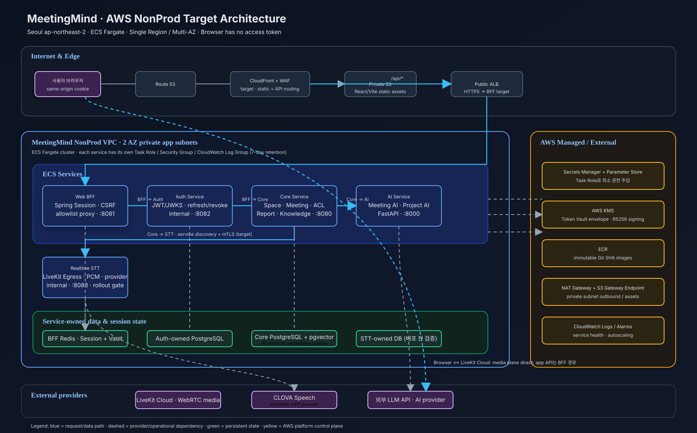

# MeetingMind AWS ECS 아키텍처

기준: `specs/002-bff-auth-msa/plan.md`, `infra/aws/foundation-status.md`, `requirements/non-functional-requirements-detail.md`.

기존 이미지에서 프로젝트 기준과 달랐던 부분을 반영했다.

- `EKS / Ingress`를 `ECS Fargate / Public ALB`로 변경했다.
- BFF, Auth, Core, AI, Realtime STT를 각각 독립 ECS Service로 분리했다. STT 컨테이너 포트는 `8083`이다.
- 브라우저의 API 요청은 `Route 53 → CloudFront/WAF → ALB → BFF`로 흐르고, 브라우저의 WebRTC 미디어는 `LiveKit Cloud`로 직접 흐른다.
- AI는 별도 AI DB를 두는 것으로 표시하지 않고, 현재 저장소 기준 `Core PostgreSQL + pgvector`를 사용하도록 표시했다. Auth DB는 별도로 분리했다.
- Private subnet, NAT Gateway, S3 Gateway Endpoint, ECR, Task Role/Security Group, Secrets Manager, KMS, CloudWatch 운영 계층을 추가했다.
- 권한 경계에 맞춰 Core가 Meeting/Space ACL을 평가한 뒤 AI·STT·LiveKit 요청을 보낸다는 흐름을 표시했다.

STT 전용 DB와 운영 service discovery/mTLS는 현재 문서상 배포 전 검증 항목이므로 그림에 확정값처럼 숨기지 않고 `배포 전 검증`으로 표시했다.
