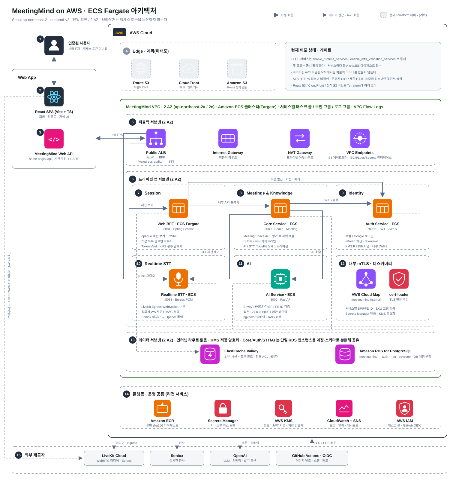

# MeetingMind AWS 아키텍처

MeetingMind의 AWS 아키텍처 기준 문서다. 이전의 `architecture-aws-ecs.*`, `architecture-aws-vams.*`를 이 문서로 통합했다.

기준 소스: `infra/aws/environments/nonprod-v2/{main.tf,locals.tf,variables.tf}`, `infra/aws/modules/*`, `specs/002-bff-auth-msa/`, `requirements/`.
다이어그램 형식은 [AWS Guidance for Visual Asset Management System on AWS](https://docs.aws.amazon.com/solutions/visual-asset-management-system-on-aws/)의 아키텍처 다이어그램 규칙(번호 단계 + 점선 그룹 + 서비스 아이콘)을 따랐다.

## How it works

1. **인증된 사용자**는 브라우저로만 접근하고 액세스 토큰을 보유하지 않는다. 세션은 BFF가 발급한 opaque 쿠키뿐이다.
2. **React SPA (Vite + TypeScript)** 가 회의·리포트·지식 화면을 제공한다.
3. **MeetingMind Web API**는 same-origin `/api` 경로만 사용한다. 세션 쿠키 + CSRF로 호출하고 브라우저는 Core/Auth/AI를 직접 호출하지 않는다.
4. **Edge (NonProd smoke 배포)** — 외부 가비아 DNS의 `app.meetingmind.co.kr`, 기존 `us-east-1` ACM 인증서, CloudFront와 OAC 기반 private S3 정적 origin을 사용한다. `/api/*`와 token-protected `/ws/egress-audio/*`만 ALB origin으로 전달한다. Route 53/WAF와 Terraform-managed ACM 발급은 정식 release gate에 남아 있다.
5. **퍼블릭 서브넷 (2 AZ)** — Public ALB가 유일한 진입점이다. `/api/*`는 BFF 타깃 그룹으로, `/ws/egress-audio/*`는 Realtime STT 타깃 그룹으로 라우팅한다. Internet Gateway가 퍼블릭 라우트를, NAT Gateway가 프라이빗 서브넷 아웃바운드를, VPC 엔드포인트가 S3 게이트웨이와 ECR/Logs/Secrets 인터페이스를 담당한다.
6. **프라이빗 앱 서브넷 (2 AZ)** — ECS Fargate 클러스터. 모든 서비스가 여기서만 돌고 서비스마다 태스크 롤·보안 그룹·CloudWatch 로그 그룹이 분리된다.
7. **Session** — `Web BFF`(`:8081`)가 opaque 세션 쿠키와 CSRF를 관리하고, 허용 목록 경로만 내부 서비스로 프록시한다. Token Vault는 KMS 봉투 암호화를 사용한다.
8. **Meetings & Knowledge** — `Core Service`(`:8080`)가 Meeting/Space ACL을 평가한 뒤 AI·STT·LiveKit 호출을 오케스트레이션한다. 리포트·지식 파이프라인의 주인이며 ECS 경계에서는 Flyway를 비활성(`SPRING_FLYWAY_ENABLED=false`)한다.
9. **Identity** — `Auth Service`(`:8082`)가 로컬/Google 로그인, refresh 회전·`revoke-all`, AWS KMS `RS256` 서명과 내부 JWKS를 제공한다. 발급자는 `https://auth.meetingmind.internal`이고 Core는 `TARGET_ONLY` 모드로 이 JWKS만 신뢰한다.
10. **Realtime STT** — `Realtime STT`(`:8083`)가 LiveKit Egress WebSocket을 일회성 HMAC 토큰으로 검증해 수신하고, `soniox-realtime`을 기본, `openai-realtime`을 폴백 provider로 사용한다.
11. **AI** — `AI Service`(FastAPI, `:8000`)가 요약·RAG를 수행한다. mTLS 모드에서는 Envoy 사이드카가 앞단에서 SPIFFE ID를 검증하고 앱은 `127.0.0.1:8001`에만 바인딩되어 Core 외에는 접근할 수 없다.
12. **내부 mTLS · 디스커버리** — AWS Cloud Map 네임스페이스 `meetingmind.internal`로 서비스를 찾고, `cert-loader` 사이드카가 Secrets Manager의 서비스별 TLS 번들을 검증해 주입한다. 서비스마다 SPIFFE ID와 허용 EKU가 고정되어 있다.
13. **데이터 서브넷 (2 AZ)** — 인터넷 라우트가 없다. **ElastiCache Valkey**는 BFF 전용 ACL 사용자로 세션과 토큰 볼트를 저장하고, **Amazon RDS for PostgreSQL** 단일 인스턴스가 `meetingmind`(Core + pgvector), `meetingmind_auth`, `meetingmind_stt` 데이터베이스를 서비스별 DB 계정으로 분리해 담는다. 저장 데이터는 KMS 키로 암호화한다.
14. **플랫폼 · 운영 공통** — ECR(불변 `sha256` 다이제스트), Secrets Manager(태스크 롤 최소 권한), KMS(Token Vault·JWT 서명·저장 암호화), CloudWatch + SNS(로그·알람·대시보드), IAM(태스크 롤 · GitHub OIDC).
15. **외부 제공자** — LiveKit Cloud(WebRTC 미디어·Egress), Soniox(실시간 전사), OpenAI(LLM·임베딩·STT 폴백), GitHub Actions OIDC(이미지 빌드·스캔·배포). 브라우저의 WebRTC 미디어는 AWS를 거치지 않고 LiveKit Cloud로 직접 흐른다.

## 런타임 호출 원칙

- Browser는 BFF만 호출한다. Auth/Core/AI/STT의 내부 주소나 MeetingMind access JWT를 알지 못한다.
- 현재 모든 Browser-facing 업무 endpoint는 Core가 소유한다. BFF의 `AI`/`LIVEKIT` 분류는 timeout·circuit·오류 격리를 위한 논리 정책이며, 실제 BFF→Core JWT audience는 `meetingmind-core`다.
- Core는 Meeting/Space ACL을 먼저 확인한 뒤 mTLS로 AI와 STT를 호출한다. Auth는 인증 데이터, Core는 업무 ACL, STT는 remote transcript, AI는 vector/runtime 데이터를 각각 소유하며 다른 서비스 DB를 직접 읽지 않는다.
- LiveKit Egress audio만 session-bound HMAC token으로 CloudFront→ALB→STT public WSS path를 사용한다. STT `/internal/*`은 Core SPIFFE mTLS만 허용한다.
- 정확한 caller/destination/audience/data-owner 표는 `specs/002-bff-auth-msa/contracts/service-call-boundaries.md`를 기준으로 한다.

## 현재 배포 상태와 게이트

- CloudFront, private S3/OAC, custom viewer domain과 `/api/*`·`/ws/egress-audio/*` ALB origin은 NonProd deployment smoke로 배포됐다.
- ALB는 CloudFront origin-facing managed prefix list만 HTTP origin으로 허용한다. 별도 ALB HTTPS listener, WAF, Route 53, Terraform-managed ACM lifecycle은 아직 정식 release gate에 남아 있다.
- Realtime STT는 ALB의 HTTPS `8083` target과 HTTP `9083` readiness target을 사용한다. 공개 경로는 `/ws/egress-audio/*` 하나뿐이며 token 없는 handshake는 `403`으로 닫힌다.

ECS 서비스는 정의만으로 뜨지 않고 게이트를 통과해야 desired count가 올라간다.

- `enable_runtime_services`(일반 런타임)와 `enable_mtls_validation_services`(프라이빗 mTLS 검증)는 동시에 켤 수 없다.
- 런타임 활성화는 `runtime_gates_acknowledged`, `internal_mtls_runtime_verified`, 서비스별 불변 `sha256` 다이제스트, `cert-loader` 다이제스트를 모두 요구한다. AI를 켜려면 미러링한 `ai-envoy` 다이제스트도 필요하다.
- 프라이빗 mTLS 검증 모드에서는 퍼블릭 리스너를 만들지 않는다.

## 다이어그램 수정 방법

`docs/architecture-aws.svg`는 손으로 작성한 SVG다. 구성 요소를 바꿀 때는 아래 좌표 규칙을 따른다.

- 캔버스 `1520 × 1620`. 서비스 타일 64px, 플랫폼 타일 56px.
- 그룹 열 x 좌표: `440 / 780 / 1120`(폭 310), 행 y 좌표: `615 / 850`(높이 215).
- 배선 레인: 열 사이 `765`, `1105`, 그룹 안쪽 여백 `430`, `412`, `1075`, `1400`. 라벨과 겹치지 않는 세로 통로다.
- 색은 AWS 카테고리 색을 쓴다. 네트워킹 `#8C4FFF`, 컴퓨트/컨테이너 `#ED7100`, 데이터베이스 `#C925D1`, 보안 `#DD344C`, 관리 `#E7157B`, ML `#01A88D`.
- 아직 배포되지 않은 요소는 회색 점선 타일(`#EDF0F3` / `#B0B8C4`)로 표시한다.
