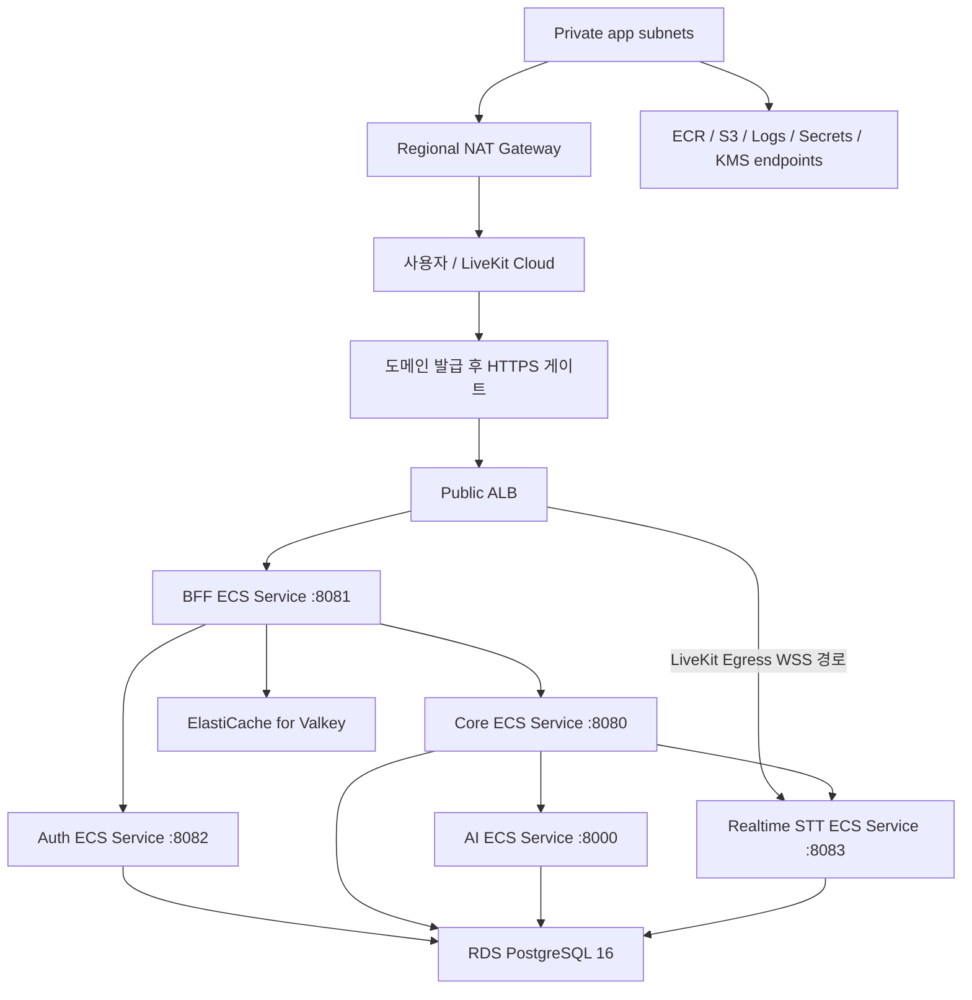

# MeetingMind NonProd V2 Terraform 구현 계획

## 1. 목적

기존 수작업 NonProd AWS 리소스를 Terraform state로 가져오지 않고, 같은 `MeetingMind-NonProd` 계정의 서울 리전에 새 `nonprod-v2` 환경을 병렬 구축한다. 기존 환경은 V2 검증과 전환이 끝날 때까지 유지하고, 별도 승인된 정리 단계에서만 삭제한다.

이 문서는 Terraform 코드 구현 순서, 모듈 경계, 리소스 기본값, 검증 및 전환 절차를 고정한다. 2026-07-24 기준 state bootstrap, 공통 모듈과 `environments/nonprod-v2` 코드를 구현했다. AWS resource `apply`와 기존 리소스 변경은 수행하지 않았다.

## 2. 확정 결정

| 항목 | 결정 |
| --- | --- |
| AWS account | 기존 `MeetingMind-NonProd` 계정 |
| Region | `ap-northeast-2` |
| Environment | `nonprod-v2` |
| 전환 방식 | 기존 리소스 import 없이 새 V2 병렬 구축 |
| 기존 데이터 | RDS 데이터 이관 없이 빈 데이터베이스에서 시작 |
| VPC | `10.20.0.0/16`, 2개 AZ |
| Public subnet | `10.20.0.0/24`, `10.20.1.0/24` |
| Private app subnet | `10.20.16.0/20`, `10.20.32.0/20` |
| Data subnet | `10.20.48.0/24`, `10.20.49.0/24` |
| NAT | Regional NAT Gateway automatic mode |
| Compute | ECS Fargate, public IP 미할당 |
| Edge | internet-facing ALB. 도메인 발급 전에는 ALB DNS로 제한된 smoke test만 수행 |
| Database | PostgreSQL 16 RDS Single-AZ NonProd |
| Cache | ElastiCache for Valkey primary 1 + replica 1, Multi-AZ/failover |
| Secret 값 | application/provider secret은 Terraform 밖에서 AWS Console로 입력. RDS master는 RDS가 관리 |
| Terraform state | 버전 관리·암호화된 S3 backend와 native S3 lockfile |
| Local auth | AWS IAM Identity Center(SSO) profile |
| CI auth | GitHub Actions OIDC, 장기 access key 금지 |

Regional NAT Gateway는 서울을 포함한 상용 리전에서 사용할 수 있다. Terraform 구현에는 `availability_mode = "regional"`과 `vpc_id`를 사용하고 `availability_zone_address`를 생략해 automatic mode를 유지한다. 이 속성을 지원하는 AWS Provider 버전을 사용해야 한다.

## 3. 범위

### 포함

- Terraform remote state bootstrap
- VPC, subnet, IGW, Regional NAT Gateway, route table
- 기본 NACL과 서비스별 Security Group
- VPC endpoint
- KMS, IAM role/policy
- ECR repository와 lifecycle
- CloudWatch Log Group, metric alarm, dashboard
- RDS PostgreSQL과 ElastiCache for Valkey
- Secrets Manager secret container와 resource policy
- public ALB, listener, target group
- ECS cluster, task definition, service, autoscaling
- 검증, cutover, rollback, 기존 리소스 정리 계획

### 제외 또는 후속 게이트

- 기존 RDS 데이터 이전
- 기존 AWS 리소스 Terraform import
- Production 계정 실제 생성
- 도메인, Route 53 hosted zone, ACM 인증서
- CloudFront/WAF를 통한 정식 public edge
- 도메인이 필요한 HTTPS browser cookie와 LiveKit `wss://` end-to-end 전환
- Q-023/D-032에서 확정한 direct mTLS, offline NonProd CA, 서비스별 TLS bundle, cert-loader와 AI Envoy 구현
- Secret 실제 값의 Terraform 입력

## 4. 목표 구성



STT의 업무 API는 Core 전용 내부 경계다. 다만 LiveKit Egress가 audio를 전달하려면 외부 `wss://.../ws/egress-audio/*` 경로가 필요하므로 ALB에 STT 전용 target group과 path rule을 둔다. 이 public WSS 경로는 짧은 수명의 1회용 token 검증을 전제로 하며, 도메인과 ACM 인증서가 없을 때는 실제 트래픽을 열지 않는다.

## 5. Terraform 소스 구조

```text
infra/aws/
├── bootstrap/
│   └── state/
│       ├── versions.tf
│       ├── providers.tf
│       ├── main.tf
│       ├── variables.tf
│       └── outputs.tf
├── modules/
│   ├── network/
│   ├── security/
│   ├── vpc-endpoints/
│   ├── kms/
│   ├── iam/
│   ├── ecr/
│   ├── observability/
│   ├── service-discovery/
│   ├── data/
│   ├── secrets/
│   ├── alb/
│   ├── ecs-cluster/
│   ├── ecs-task/
│   └── ecs-service/
└── environments/
    └── nonprod-v2/
        ├── backend.hcl.example
        ├── versions.tf
        ├── providers.tf
        ├── locals.tf
        ├── variables.tf
        ├── main.tf
        ├── outputs.tf
        └── terraform.tfvars.example
```

- `bootstrap/state`는 상태 저장소만 생성하며 application stack과 state를 공유하지 않는다.
- `modules/*`는 계정·환경명을 하드코딩하지 않는다.
- `environments/nonprod-v2`가 모듈 조합, 실제 CIDR, 이름, tag를 소유한다.
- 실제 `backend.hcl`, `terraform.tfvars`, plan 파일과 secret 파일은 커밋하지 않는다.
- `.terraform.lock.hcl`은 provider checksum을 고정하므로 커밋한다.

## 6. 버전과 상태 관리

### Terraform/provider

- Terraform CLI: `>= 1.10, < 2.0`
- AWS Provider: Regional NAT Gateway Terraform 지원을 포함하는 `>= 6.49, < 7.0`
- 첫 `terraform init`에서 생성한 `.terraform.lock.hcl`을 검토하고 커밋한다.
- 현재 lock file은 공식 HashiCorp AWS Provider `6.56.0`을 선택했다.
- provider와 module source는 공식 HashiCorp/AWS 또는 저장소 내부 모듈만 사용한다.

### Remote state bootstrap

1. 로컬 state로 전용 S3 bucket을 만든다.
2. bucket은 Block Public Access, versioning, SSE-KMS, TLS-only bucket policy를 적용한다.
3. application stack backend는 `use_lockfile = true`를 사용한다.
4. DynamoDB lock table은 신규 생성하지 않는다.
5. backend bucket 이름은 계정 ID를 포함한 전역 고유 이름으로 만든다.
6. bootstrap state 자체는 별도 로컬 암호화 백업 또는 제한된 bootstrap backend로 관리하며 application state와 섞지 않는다.

Terraform state에는 민감한 값이 들어갈 수 있으므로 접근 주체를 운영자와 배포 역할로 최소화한다. Secret 값은 Terraform resource argument나 output으로 전달하지 않는다.

## 7. 공통 이름과 tag

기본 이름 규칙은 `meetingmind-nonprod-v2-<component>`다.

Provider `default_tags`:

```hcl
{
  Project     = "MeetingMind"
  Environment = "nonprod-v2"
  ManagedBy   = "terraform"
  Repository  = "Meeting-Mind/MeetingMind"
}
```

- 서비스 전용 리소스에는 `Service = bff|auth|core|ai|realtime-stt`를 추가한다.
- 공용 리소스에는 `Service = platform`을 사용한다.
- AWS가 `Name` tag를 지원하는 리소스에는 같은 이름 규칙을 적용한다.
- 기존 `ManagedBy=manual` 리소스와 V2 `ManagedBy=terraform` 리소스를 혼용하지 않는다.

## 8. 모듈별 구현 계약

### 8.1 Network

- VPC DNS support/hostnames 활성화
- 2개 AZ를 계정의 가용 AZ 목록에서 고정 선택하고 output으로 노출
- Public subnet은 ALB 전용, Private app subnet은 ECS 전용, Data subnet은 RDS/Valkey 전용
- IGW와 public route table의 `0.0.0.0/0` route 생성
- Regional NAT Gateway automatic mode 생성
- private app route table의 `0.0.0.0/0`를 Regional NAT Gateway로 연결
- data route table에는 인터넷 default route를 두지 않음
- VPC Flow Logs를 CloudWatch Logs로 전송
- S3 Gateway Endpoint를 route table에 연결

NACL은 초기에는 stateful Security Group을 주 통제 수단으로 쓰고 AWS 기본 허용 NACL을 명시적으로 관리한다. 서비스 포트별 stateless NACL을 조기에 좁혀 ephemeral return traffic을 깨뜨리지 않는다. 별도 위협 모델이 승인되면 deny rule을 추가한다.

### 8.2 VPC endpoint

Private ECS task가 NAT를 우회해 AWS 서비스에 접근하도록 다음 endpoint를 검토·구성한다.

- Gateway: S3
- Interface: ECR API, ECR DKR, CloudWatch Logs, Secrets Manager, KMS

Interface endpoint Security Group은 private app subnet CIDR 또는 ECS task SG에서 `443`만 허용한다. STS endpoint는 application이 runtime에서 STS를 호출할 때만 추가한다.

### 8.3 Security Group

| Destination | Inbound source | Port |
| --- | --- | --- |
| ALB | 초기 smoke test용 제한 CIDR, 도메인 이후 CloudFront 정책 | `80`, 이후 `443` |
| BFF | ALB SG | `8081` |
| Auth | BFF SG | `8082` |
| Core | BFF SG | `8080` |
| AI | Core SG | `8000` |
| STT internal API | Core SG | `8083` |
| STT WSS | ALB SG | `8083` |
| RDS | Auth/Core/AI/STT SG | `5432` |
| Valkey | BFF SG | `6379` |
| VPC endpoints | ECS service SG | `443` |

- CIDR 기반 service-to-service 허용보다 SG 참조를 우선한다.
- ECS task inbound에 `0.0.0.0/0`를 사용하지 않는다.
- RDS/Valkey는 public access를 금지한다.
- task outbound는 내부 SG, endpoint, DB/cache를 정확한 destination SG/port로 제한한다.
- Google/OpenAI/LiveKit/STT provider는 IP가 동적으로 바뀌므로 호출이 필요한 Auth/Core/AI/STT에만 Regional NAT 방향 TCP `443`을 허용한다. 이 예외는 NonProd 한정, 2026-10-31 만료로 기록하고 Production 전 domain-filtering egress control 결정을 다시 연다.

### 8.4 Service Discovery

- Cloud Map Private DNS namespace는 `meetingmind.internal`로 고정한다.
- `auth`, `core`, `ai`, `stt` A record service만 만들고 BFF는 public ALB target이므로 내부 discovery에 등록하지 않는다.
- namespace/service는 runtime off foundation에서 생성하고 ECS Task private IP instance는 staged ECS Service가 관리한다.
- ECS-managed custom health는 container liveness와 Task state를 반영한다. application readiness를 대신하지 않으므로 caller timeout/circuit breaker와 readiness `503`을 별도로 검증한다.

### 8.5 KMS/IAM

- Terraform state, application secret, RDS, Valkey, CloudWatch Logs 용도를 구분해 KMS key/alias 경계를 정의한다.
- JWT signing key는 RSA-2048 `SIGN_VERIFY`, key spec과 rotation 절차를 Auth 계약에 맞춘다.
- 서비스별 ECS execution role은 공통 ECR pull/CloudWatch log write 권한과 자기 Task Definition이 참조하는 Secret/KMS decrypt만 허용한다.
- 서비스별 task role은 자신의 secret, DB 인증/연결 보조, 필요한 AWS API만 허용한다.
- BFF token bundle KMS 권한과 Auth JWT signing 권한을 다른 task role에 둔다.
- IAM policy resource에 가능한 한 구체적인 ARN을 사용하고 wildcard action/resource를 검토 gate로 처리한다.

### 8.6 ECR

- `bff`, `auth`, `core`, `ai`, `realtime-stt` repository 분리
- tag immutability 활성화
- scan-on-push 활성화
- lifecycle은 최근 배포/rollback에 필요한 image를 남기고 오래된 untagged image부터 만료
- ECS task definition에는 배포 시 image digest를 사용하고 Git commit SHA와 대응 기록

### 8.7 Data

#### RDS

- PostgreSQL 16, DB subnet group은 두 Data subnet 사용
- NonProd는 Single-AZ로 시작하되 automated backup, encryption, deletion protection 활성화
- `manage_master_user_password = true`로 master password를 RDS/Secrets Manager가 생성·회전
- public accessibility 비활성화
- parameter group에서 연결 수, 로그, `pgvector` 요구사항을 검토
- 하나의 NonProd 인스턴스 안에서 Core/Auth/STT 논리 database와 migration/runtime role을 분리
- AI의 vector 저장은 현재 Core-owned schema/계약을 따르고 임의의 cross-service DB join을 추가하지 않음
- 신규 빈 RDS에서 migration을 실행하므로 기존 DB snapshot restore/data migration은 없음

Terraform 실수 방지를 위해 RDS instance와 KMS key에는 `prevent_destroy`를 우선 적용한다. 최종 폐기 시에는 별도 승인으로 protection을 해제하고 final snapshot을 남기는 두 단계 변경을 사용한다.

#### ElastiCache for Valkey

- replication group, primary 1 + replica 1
- 두 Data subnet과 Multi-AZ automatic failover
- transit encryption과 at-rest encryption 활성화
- Valkey 7.2+ IAM authentication user/user group과 BFF task role 최소 권한 사용
- BFF session/token-vault namespace와 TTL 계약 검증
- BFF client의 15분 token 자동 갱신과 12시간 connection 재인증 검증

### 8.8 Secrets Manager

Terraform은 다음 secret의 이름, 설명, KMS key, resource policy와 ECS 접근 권한만 만든다.

- 서비스별 DB runtime/migration credential
- BFF token encryption 관련 설정
- Auth refresh HMAC key
- LiveKit API key/secret
- OpenAI/provider secret
- STT provider secret
- 서비스별 `bff/auth/core/ai/stt` TLS bundle

RDS master credential은 `manage_master_user_password = true`로 RDS가 Secrets Manager에서 생성·회전하고 Terraform은 secret ARN만 다룬다. Valkey는 장기 password 대신 Valkey 7.2 이상의 IAM authentication user와 BFF task role을 사용한다. BFF에는 15분 token 갱신과 12시간 connection 재인증을 지원하는 credentials provider가 필요하므로 T046 전 application preflight로 검증한다.

그 밖의 application/provider secret은 사용자가 AWS Console에서 값을 입력한다. 구현 원칙:

- `secret_string`, `secret_binary`와 실제 비밀번호를 Terraform에 선언하지 않음
- `.tfvars`, shell history, plan artifact, output에 secret 원문을 넣지 않음
- ECS task definition은 secret ARN/JSON key만 참조
- secret version이 아직 없으면 ECS service 생성 전 preflight가 실패하도록 명시적 체크리스트 적용

TLS bundle은 application 환경변수로 주입하지 않는다. 전용 ARM64 cert-loader가 task role로 자신의 exact bundle ARN만 읽고 검증한 뒤 task-scoped shared volume에 기록한다. 자세한 secret schema, offline key custody, AI Envoy 경계, gate와 rotation은 `mtls-implementation-plan.md`를 따른다.

### 8.9 ALB/edge

- internet-facing ALB는 두 Public subnet 사용
- target group은 BFF `8081`, STT `8083`를 분리
- health check는 각 서비스의 readiness path를 사용
- deployment 중 deregistration delay, slow start 여부와 circuit breaker를 서비스 특성에 맞게 설정
- 도메인 전에는 ALB DNS와 제한된 source CIDR의 HTTP listener로 인프라 smoke test만 수행
- `Secure`/`__Host-` cookie와 LiveKit WSS 검증은 도메인+ACM+HTTPS listener 전에는 출시 완료로 간주하지 않음
- 도메인 발급 후 Route 53, ACM, HTTPS `443`, HTTP redirect, CloudFront/WAF 및 direct ALB 우회 차단을 별도 단계로 적용

### 8.10 ECS

- 단일 `meetingmind-nonprod-v2` ECS Fargate cluster
- Container Insights 활성화
- 모든 service는 두 Private app subnet, `assign_public_ip = false`
- 서비스별 task definition, task role, SG, Log Group
- 초기 desired count는 서비스당 1이며 가용성/SLO 결정 후 BFF/Auth/Core의 2 이상 여부를 조정
- deployment circuit breaker와 automatic rollback 활성화
- 최소 healthy percent/max percent, health check grace period를 서비스별 명시
- AI background worker가 별도 실행 모델을 요구하면 같은 image의 별도 task definition/service로 분리
- Cloud Map/direct mTLS 구현 전에는 service discovery/mTLS 구성을 임시 public 경로로 우회하지 않음

### 8.11 CloudWatch

- 서비스별 Log Group, NonProd retention 7일, KMS encryption
- ECS CPU/memory, running task count, deployment failure
- ALB 4xx/5xx, target 5xx, unhealthy host, latency
- RDS CPU/storage/connections/freeable memory
- Valkey CPU/memory/eviction/replication lag
- NAT error/port/allocation 관련 지표
- application login/refresh/session/Auth/Core/AI/STT/LiveKit/KMS 지표
- SNS alarm destination은 별도 입력값으로 두고 수신 대상 승인 전 비워 둘 수 있음

## 9. 구현 순서와 의존성

| 단계 | 작업 | 선행 조건 | 완료 기준 |
| --- | --- | --- | --- |
| 0 | 로컬 도구와 SSO 확인 | 사용자 준비 완료 통보 | `terraform version`, `aws sts get-caller-identity`가 기대 account/region을 가리킴 |
| 1 | state bootstrap | 단계 0 | versioned/encrypted/private S3 backend와 native lock 검증 |
| 2 | root/provider/tag 계약 | 단계 1 | `fmt`, `init`, `validate`와 empty plan 구조 통과 |
| 3 | network/NACL/route/NAT | 단계 2 | subnet/route/IGW/Regional NAT/Flow Logs 검증 |
| 4 | SG/VPC endpoints | 단계 3 | reachability matrix와 endpoint DNS 검증 |
| 5 | KMS/IAM/ECR/Log Group | 단계 4 | least-privilege 검토와 repository/log 기반 리소스 생성 |
| 6 | RDS/Valkey/secret container | 단계 5 | private connectivity, encryption, backup/failover 설정 검증 |
| 7 | Console application/provider secret version 입력 | 단계 6, 사용자 | RDS-managed master secret과 수동 입력 대상 secret에 current version 존재 |
| 8 | ALB/target group | 단계 5 | 제한된 smoke listener와 target health contract 검증 |
| 9 | image push/task definition | 단계 5, 로컬 Docker | digest 기반 task definition 등록 |
| 10 | ECS service | 단계 6~9, Q-023 | service 안정화, 내부 호출 및 rollback 검증 |
| 11 | CloudWatch/autoscaling | 단계 10, Q-013 | dashboard/alarm/scale test 통과 |
| 12 | 도메인/HTTPS edge | 도메인 발급 | browser cookie, CloudFront/WAF, LiveKit WSS E2E 통과 |
| 13 | V2 cutover/관측 | 단계 11~12 | 기능/보안/장애 테스트와 rollback drill 통과 |
| 14 | 기존 환경 정리 | 사용자 별도 승인 | inventory와 dependency 확인 후 recoverable 순서로 제거 |

## 10. 사전 준비 체크리스트

사용자가 “로컬 도구 준비 완료”를 알리면 구현 시작 전에 다음을 확인한다.

- Terraform CLI `>=1.10`
- AWS CLI v2
- Docker/Buildx
- GitHub CLI는 CI/OIDC 작업을 함께 할 때만 필요
- `MeetingMind-NonProd` IAM Identity Center profile
- `aws sts get-caller-identity`의 account ID 확인
- `ap-northeast-2` 접근 가능
- state bucket과 KMS/IAM을 생성할 bootstrap 권한
- VPC/RDS/ElastiCache/ECS/ECR/ALB/CloudWatch/Secrets Manager/IAM 생성 권한
- AWS service quota와 예상 비용 확인
- secret 이름 목록과 Console 입력 담당자
- smoke test를 허용할 운영자 public CIDR

로컬 인증정보, AWS account ID, secret 값은 문서나 저장소에 기록하지 않는다.

## 11. 코드 품질과 검증 파이프라인

각 단계에서 다음 순서를 지킨다.

1. `terraform fmt -check -recursive`
2. `terraform init -backend=false` 또는 단계별 backend init
3. `terraform validate`
4. `terraform plan -out=<ignored path>`
5. plan의 create/update/delete 수동 검토
6. apply 후 AWS API/Console과 output 대조
7. `terraform plan -detailed-exitcode`로 drift 확인
8. `git diff --check`와 secret scan

삭제가 표시된 plan은 현재 V2 범위에서도 자동 승인하지 않는다. 기존 V1 resource ID가 plan에 나타나면 apply를 중단한다.

## 12. 보호, 전환, 롤백

### 보호

- 기존 수작업 환경의 resource ID는 V2 variable/data source로 참조하지 않는다.
- state bucket, KMS key, RDS에는 삭제 방지 수단을 적용한다.
- IAM 권한과 secret policy 변경은 별도 plan으로 검토한다.
- 기존 RDS 데이터는 불필요하지만, 기존 환경 삭제는 V2 완료와 같은 apply에 포함하지 않는다.

### Cutover

1. 새 RDS migration과 seed 최소값 적용
2. Secret Console 입력과 ECS task secret resolve 확인
3. 내부 health/readiness와 service-to-service 연결 확인
4. ALB 제한 경로 smoke test
5. 도메인 발급 후 HTTPS/browser/LiveKit WSS 검증
6. 기능, 권한, 로그 secret/PII scan, 장애 테스트
7. 트래픽 전환
8. 정해진 관측 기간 동안 기존 환경 유지

### Rollback

- V2 application 오류는 이전 ECS task definition revision으로 rollback한다.
- V2 인프라 오류는 기존 수작업 환경으로 트래픽을 되돌린다.
- DB schema migration은 forward-only 원칙을 사용하고 destructive down migration에 의존하지 않는다.
- rollback 검증 전 기존 ALB/ECS/RDS/Valkey를 삭제하지 않는다.

### 기존 환경 정리

정리 작업은 별도 Terraform stack에 억지로 import하지 않는다. AWS Resource Explorer/Tag Editor와 서비스별 inventory로 dependency를 확인하고, 사용자의 명시적 승인 후 수작업 리소스를 안전한 순서로 삭제한다. RDS는 데이터가 불필요하더라도 final snapshot 생성 여부를 마지막으로 확인한다.

## 13. 구현 중 남은 출시 게이트

| Gate | 영향 | 다음 결정 시점 |
| --- | --- | --- |
| Q-013 SLO/RTO/RPO | desired count, autoscaling, backup, alarm | ECS service/observability 구현 전 |
| T047-B~D | offline CA, cert-loader, AI Envoy, 인증서 회전과 principal negative 검증 | private validation deployment와 정상 ECS service 연결 전 |
| Q-024 CloudFront/WAF와 ALB 우회 차단 | 정식 public edge | 도메인 발급 후 |
| 도메인/ACM 미발급 | Secure cookie와 LiveKit WSS E2E | 사용자가 도메인 준비 완료 통보 후 |
| 수동 secret version 미입력 | ECS task 시작 | data/secrets apply 후 사용자 Console 입력 |

## 14. 현재 구현 상태

| 범위 | 상태 | 검증 |
| --- | --- | --- |
| State bootstrap | Code complete, apply pending | 실제 NonProd 계정 read-only plan `9 add / 0 change / 0 destroy` |
| KMS/Network/NACL/Route/Regional NAT | Code complete, apply pending | AWS Provider 6.56.0 `validate`와 mock plan |
| SG/VPC endpoint/IAM/ECR | Code complete, apply pending | AWS Provider 6.56.0 `validate`와 mock plan |
| RDS/Valkey/Secrets | Code complete, apply pending | RDS-managed master/Valkey IAM 구조 `validate` |
| ALB/ECS/CloudWatch | Code complete, runtime disabled | runtime acknowledgement와 CIDR safety test |
| Route 53/ACM/CloudFront/WAF | Deferred | 도메인과 Q-024 필요 |
| Service discovery | Source complete, apply pending | T047-A Cloud Map, exact HTTPS 주소, staged service/digest/desired count와 mTLS-ready gate 7/7 |
| Internal least privilege | Source complete, runtime verification pending | 서비스별 execution secret ARN, 명시적 SG egress, customer-managed SNS encryption |
| Direct mTLS | Java source complete, PKI/AI/runtime pending | T047-B1~B4 offline CA/cert-loader/delivery/rotation, T047-C2 AI Envoy, T047-D AWS negative 검증 |

`enable_runtime_services` 기본값은 `false`다. 구현 시 `internal_mtls_material_ready`와 `internal_mtls_runtime_verified`를 분리해 private validation deployment와 정상 runtime gate의 순환 의존성을 없앤다. secret version, DB bootstrap, 7개 image digest, BFF Valkey IAM client와 T047-B~D 검증이 완료돼야 runtime verified, 명시적 acknowledgement와 제한된 `runtime_enabled_services` allowlist를 함께 설정할 수 있다.

## 15. 공식 참고

- [Terraform S3 backend와 native lockfile](https://developer.hashicorp.com/terraform/language/backend/s3)
- [Terraform dependency lock file](https://developer.hashicorp.com/terraform/language/files/dependency-lock)
- [AWS Regional NAT Gateway](https://docs.aws.amazon.com/vpc/latest/userguide/nat-gateways-regional.html)
- [Terraform AWS Provider NAT Gateway resource](https://registry.terraform.io/providers/hashicorp/aws/latest/docs/resources/nat_gateway)
- [ElastiCache for Valkey IAM authentication](https://docs.aws.amazon.com/AmazonElastiCache/latest/dg/auth-iam.html)
- [AWS Terraform remote state 보안 지침](https://docs.aws.amazon.com/prescriptive-guidance/latest/terraform-aws-provider-best-practices/security.html)
- [AWS Terraform backend 지침](https://docs.aws.amazon.com/prescriptive-guidance/latest/terraform-aws-provider-best-practices/backend.html)
