# ERD Draft: MeetingMind Core Prototype

이 문서는 backend 전체 도메인의 ERD 초안이다. 구현자는 API 계약 변경이나 DB schema 변경 전에 이 파일과 `data-model.md` 영향 여부를 확인한다.

> `AUTH_SESSION.refreshTokenHash`는 현재 Core 호환 schema다. 목표 BFF Session/Token Vault/Auth DB 관계는 `../002-bff-auth-msa/erd.md`가 대체하며 기존 migration은 rollback window가 끝날 때까지 보존한다.

T035 internal User projection과 dual access validation은 V13의 기존 `USER.authUserId`를 사용하므로 새로운 물리 relation이나 cross-DB FK를 추가하지 않는다.

## Mermaid ERD

```mermaid
erDiagram
  USER ||--o{ AUTH_IDENTITY : has
  USER ||--o{ AUTH_SESSION : has
  USER ||--o{ SPACE_MEMBER : joins
  USER ||--o{ MEETING_PARTICIPANT : participates
  USER ||--o{ MEETING_REPORT : creates
  USER ||--o{ TASK_CANDIDATE : creates
  USER ||--o{ MEETING_JOIN_REQUEST : requests
  USER ||--o{ TASK_CARD : assigned
  USER ||--o{ MEETING_MESSAGE : writes
  USER ||--o{ MEETING_ATTACHMENT : uploads
  USER ||--o{ PROJECT_AI_MESSAGE : owns

  SPACE ||--o{ SPACE_MEMBER : has
  SPACE ||--o{ MEETING : owns
  SPACE ||--o{ SPACE_INVITATION : issues
  SPACE ||--o{ PROJECT_KNOWLEDGE : has
  SPACE ||--o{ PROJECT_AI_MESSAGE : contains
  SPACE ||--o{ DOMAIN_TERM : defines
  SPACE ||--o{ TASK_CARD : has
  SPACE ||--o{ EMBEDDING_CHUNK : indexes
  SPACE ||--o{ EMBEDDING_JOB : runs
  SPACE ||--o{ AUDIT_LOG : records

  MEETING ||--o{ MEETING_PARTICIPANT : grants
  MEETING ||--o{ MEETING_JOIN_REQUEST : receives
  MEETING ||--o{ MEETING_SPEAKER : has
  MEETING ||--o| MEETING_TRANSCRIPT : transcribes
  MEETING ||--o{ TRANSCRIPT_SEGMENT : contains
  MEETING ||--o{ MEETING_REPORT : has
  MEETING ||--o{ TASK_CANDIDATE : suggests
  MEETING ||--o{ MEETING_MESSAGE : contains
  MEETING ||--o{ MEETING_ATTACHMENT : stores
  MEETING ||--o{ MEETING_ROOM : opens
  MEETING ||--o{ EMBEDDING_CHUNK : indexes

  MEETING_SPEAKER ||--o{ TRANSCRIPT_SEGMENT : speaks
  MEETING_MESSAGE ||--o{ MEETING_ATTACHMENT : publishes
  MEETING_REPORT ||--o{ REPORT_DECISION : contains
  MEETING_REPORT ||--o{ REPORT_ACTION_ITEM : contains
  TASK_CANDIDATE ||--o| TASK_CARD : confirmed_as

  PROJECT_KNOWLEDGE ||--o{ EMBEDDING_CHUNK : source
  PROJECT_KNOWLEDGE ||--o{ EMBEDDING_JOB : reindexes
  EMBEDDING_JOB ||--o{ EMBEDDING_CHUNK : produces
  TRANSCRIPT_SEGMENT ||--o{ CHUNK_SOURCE_SEGMENT : source
  EMBEDDING_CHUNK ||--o{ CHUNK_SOURCE_SEGMENT : includes
  MEETING_ATTACHMENT ||--o{ ATTACHMENT_CHUNK_ANCHOR : anchors
  EMBEDDING_CHUNK ||--o{ ATTACHMENT_CHUNK_ANCHOR : cites
  MEETING_ATTACHMENT ||--o{ EMBEDDING_JOB : reindexes

  USER {
    string id PK
    uuid authUserId UK
    string email
    string displayName
    string pictureUrl
    string status
    datetime createdAt
    datetime lastLoginAt
  }

  AUTH_IDENTITY {
    string id PK
    string userId FK
    string provider
    string providerUserId
    string passwordHash
    datetime createdAt
    datetime lastUsedAt
  }

  AUTH_SESSION {
    string id PK
    string userId FK
    string refreshTokenHash
    datetime issuedAt
    datetime expiresAt
    datetime revokedAt
    string userAgent
  }

  SPACE {
    string id PK
    string name
    string description
    string createdBy FK
    datetime deletedAt
    datetime createdAt
    datetime updatedAt
  }

  SPACE_MEMBER {
    string id PK
    string spaceId FK
    string userId FK
    string role
    datetime joinedAt
    datetime removedAt
  }

  SPACE_INVITATION {
    string id PK
    string spaceId FK
    string email
    string role
    string status
    string tokenHash
    datetime expiresAt
    datetime acceptedAt
    datetime declinedAt
  }

  MEETING {
    string id PK
    string spaceId FK
    string title
    string description
    datetime scheduledAt
    datetime scheduledEndAt
    datetime startedAt
    datetime endedAt
    string status
    string failureReason
    string retentionPolicy
    string joinCodeHash
    datetime deletedAt
    string deletedBy FK
  }

  MEETING_PARTICIPANT {
    string id PK
    string meetingId FK
    string userId FK
    string role
    string participantType
    string accessStatus
  }

  MEETING_JOIN_REQUEST {
    string id PK
    string meetingId FK
    string userId FK
    string status
    datetime requestedAt
    datetime reviewedAt
    string reviewedBy FK
  }

  MEETING_ROOM {
    string id PK
    string meetingId FK
    string provider
    string providerRoomName
    datetime openedAt
    datetime closedAt
  }

  MEETING_SPEAKER {
    string id PK
    string meetingId FK
    string label
    string displayName
    datetime createdAt
  }

  MEETING_TRANSCRIPT {
    string meetingId PK,FK
    string status
    string provider
    string language
    datetime startedAt
    datetime completedAt
    string failureReason
    datetime retentionUntil
    boolean legalHold
    datetime purgedAt
    datetime createdAt
    datetime updatedAt
  }

  TRANSCRIPT_SEGMENT {
    string id PK
    string meetingId FK
    string speakerId FK
    int sequence
    int startMs
    int endMs
    string text
    string source
  }

  MEETING_MESSAGE {
    string id PK
    string meetingId FK
    string authorUserId FK
    string text
    datetime createdAt
    datetime deletedAt
  }

  MEETING_ATTACHMENT {
    string id PK
    string meetingId FK
    string messageId FK
    string uploadedBy FK
    string originalFilename
    string contentType
    long sizeBytes
    string sha256
    string objectKey
    string status
    string extractionFailureCode
    string extractedTextObjectKey
    int extractedChars
    datetime retentionUntil
    datetime uploadExpiresAt
    datetime completedAt
    datetime deletedAt
    datetime expiredAt
  }

  MEETING_REPORT {
    string id PK
    string meetingId FK
    string status
    string title
    string summary
    string markdown
    string createdBy FK
    json sourceIds
    int version
    boolean isCurrent
    datetime createdAt
    datetime confirmedAt
  }

  REPORT_DECISION {
    string id PK
    string reportId FK
    string title
    string rationale
    json sourceIds
  }

  REPORT_ACTION_ITEM {
    string id PK
    string reportId FK
    string title
    string assigneeName
    date dueDate
    string confirmationState
    json sourceIds
  }

  TASK_CANDIDATE {
    string id PK
    string meetingId FK
    string title
    string assigneeName
    string suggestedAssigneeId FK
    date dueDate
    string status
    json sourceIds
    string createdBy FK
    datetime createdAt
    datetime confirmedAt
  }

  TASK_CARD {
    string id PK
    string spaceId FK
    string meetingId FK
    string sourceCandidateId FK
    string title
    string description
    string status
    string priority
    string[] labels
    string assigneeId FK
    date dueDate
    datetime createdAt
    datetime updatedAt
    datetime deletedAt
  }

  PROJECT_KNOWLEDGE {
    string id PK
    string spaceId FK
    string type
    string title
    string content
    string sourceMeetingId FK
    string approvedBy FK
    string status
    string embeddingStatus
    string embeddingJobId
    datetime createdAt
    datetime updatedAt
    datetime deletedAt
  }

  PROJECT_AI_MESSAGE {
    string id PK
    string spaceId FK
    string userId FK
    string role
    string content
    datetime createdAt
  }

  DOMAIN_TERM {
    string id PK
    string spaceId FK
    string term
    string definition
    string status
    datetime createdAt
    datetime updatedAt
    datetime archivedAt
  }

  EMBEDDING_CHUNK {
    string id PK
    string spaceId FK
    string meetingId FK
    string scope
    string sourceType
    string sourceId
    string embeddingJobId FK
    int generation
    boolean isActive
    string content
    string embeddingText
    vector embedding
    json metadata
    datetime createdAt
    datetime replacedAt
  }

  EMBEDDING_JOB {
    string id PK
    string spaceId FK
    string projectKnowledgeId FK
    string meetingId FK
    string attachmentId FK
    string status
    string model
    int dimension
    int generation
    int attemptCount
    string triggerReason
    string contentHash
    string failureCode
    datetime nextAttemptAt
    datetime leaseExpiresAt
    datetime createdAt
    datetime startedAt
    datetime completedAt
  }

  CHUNK_SOURCE_SEGMENT {
    string id PK
    string chunkId FK
    string segmentId FK
  }

  ATTACHMENT_CHUNK_ANCHOR {
    string id PK
    string chunkId FK
    string attachmentId FK
    int pageNumber
    int charStart
    int charEnd
  }

  AUDIT_LOG {
    string id PK
    string spaceId FK
    string actorUserId FK
    string action
    string targetType
    string targetId
    json beforeValue
    json afterValue
    datetime occurredAt
  }
```

## Key Modeling Rules

- `SpaceMember`와 `MeetingParticipant`는 분리한다. Space 멤버라도 MeetingParticipant 또는 owner/admin override 없이는 특정 회의 데이터에 접근할 수 없다.
- 회의 게스트는 `MeetingParticipant.participantType=guest`로 표현하고 Space 전체 권한을 갖지 않는다.
- SpaceMember 제거 시 같은 Space의 `participantType=member` MeetingParticipant는 `participantType=guest`로 전환한다. SpaceMember 제거는 프로젝트 전체 접근권만 제거하며, 회의 접근 차단은 MeetingParticipant revoke로 처리한다.
- HOST의 회의방 일시 퇴장은 `MEETING_PARTICIPANT`를 변경하지 않는다. 마지막 active HOST의 role 강등, `REVOKED` 전환, participant 제거는 거부한다.
- `TranscriptSegment`는 원본 전사 단위이고 `EmbeddingChunk`는 RAG 검색 단위다.
- `MeetingTranscript`는 회의당 하나의 전사 상태/보존 aggregate다. 기존 `TranscriptSegment.meetingId` FK는 `Meeting`을 직접 참조한다.
- 짧은 transcript 발화는 `EmbeddingChunk` 하나에 3-8개 segment를 묶고 `CHUNK_SOURCE_SEGMENT`로 원본을 추적한다.
- AI 응답의 `SourceReference`는 논리 response model이다. DB에서는 candidate의 `sourceIds`와 chunk의 `CHUNK_SOURCE_SEGMENT`로 근거를 추적한다.
- AI가 생성한 회의록과 태스크는 먼저 `CANDIDATE` 상태로 두고, 사용자가 확정한 뒤 `MeetingReport.CONFIRMED` 또는 `TaskCard`가 된다.
- Project AI는 `ProjectKnowledge`와 권한 필터를 통과한 meeting chunk만 사용한다.

## Constraints and Indexes

### Identity and Auth

- `USER.email`은 unique다. 탈퇴/비활성 계정 재가입 정책은 Auth owner가 결정한다.
- `AUTH_IDENTITY(provider, providerUserId)`는 unique다.
- `AUTH_IDENTITY.passwordHash`는 `provider=local`일 때만 required다.
- `USER.authUserId`는 Auth UUID subject용 nullable unique projection이며 Auth DB와 물리 FK를 만들지 않는다. 기존 업무 FK는 `USER.id`를 유지한다.
- `AUTH_SESSION.refreshTokenHash`는 unique이며 refresh token 원문은 저장하지 않는다.
- `AUTH_SESSION(userId, revokedAt, expiresAt)` index를 둔다.

### Space and Permission

- `SPACE.deletedAt`이 null인 행만 활성 Space로 취급한다.
- `SPACE_MEMBER(spaceId, userId)`는 active member 기준 unique다. `removedAt`이 null이면 active다.
- `SPACE_MEMBER.role`은 `OWNER`, `ADMIN`, `MEMBER` 중 하나다.
- Space당 active `OWNER`는 정확히 1명이어야 한다.
- `SPACE_INVITATION.spaceId`는 required이며, 수락 시 `SpaceMember`를 생성한다.
- `SPACE_INVITATION.status`는 `PENDING`, `ACCEPTED`, `DECLINED`, `EXPIRED` 중 하나다.
- `SPACE_INVITATION.tokenHash`는 unique이며 token 원문은 저장하지 않는다.
- Space invitation token은 생성 응답에서 초대 권한자에게 한 번만 반환하고, 수락/거절 시 인증 이메일과 token hash를 함께 검증한다. 기본 만료는 7일이다.
- `MEETING_JOIN_REQUEST(meetingId, userId)`는 pending 기준 unique다. join request는 회의 URL 또는 joinCode로 생성되고 host 승인 후 `MeetingParticipant`를 생성한다.
- `MEETING_JOIN_REQUEST.status`는 `PENDING`, `APPROVED`, `REJECTED` 중 하나다.
- `MEETING.joinCodeHash`는 unique다. 원문 코드는 생성/인가된 조회 응답에만 노출하고 영속 저장하지 않는다.

### Meeting and Transcript

- `MEETING(spaceId, scheduledAt)` index를 둔다.
- `MEETING.status`는 `SCHEDULED`, `IN_PROGRESS`, `ENDED`, `CANCELED` 중 하나다.
- `MEETING.deletedAt`과 `deletedBy`는 함께 null이거나 함께 값이 있는 soft-delete metadata다. active Meeting 조회와 AI context는 `deletedAt is null`을 적용한다.
- `MEETING_PARTICIPANT(meetingId, userId)`는 active participant 기준 unique다.
- `MEETING_PARTICIPANT.role`은 `HOST`, `EDITOR`, `VIEWER` 중 하나다.
- `MEETING_PARTICIPANT.participantType`은 `member`, `guest` 중 하나다.
- `MEETING_PARTICIPANT.accessStatus`는 `ACTIVE`, `REVOKED` 중 하나다. 회의 접근 평가는 `ACTIVE`만 허용한다.
- `MEETING_SPEAKER(meetingId, label)`은 unique다.
- `MEETING_TRANSCRIPT.meetingId`는 PK/FK이며 회의당 최대 하나다.
- `MEETING_TRANSCRIPT.status`는 `PENDING`, `PROCESSING`, `COMPLETED`, `FAILED` 중 하나다.
- `MEETING.retentionPolicy`는 `DAYS_7`, `DAYS_30`, `PERMANENT` 중 하나이고 기본값은 `DAYS_30`이다.
- 기간 보존 transcript는 `retentionUntil`을 가지며 `legalHold=true`이면 정리 대상에서 제외한다.
- `TRANSCRIPT_SEGMENT(meetingId, sequence)`은 unique다.
- `TRANSCRIPT_SEGMENT(meetingId, startMs)` index를 둔다.
- `MEETING_MESSAGE`는 text가 있거나 active `MEETING_ATTACHMENT`를 하나 이상 가져야 한다. soft-deleted message와 attachment는 기본 목록/RAG에서 제외한다.
- `MEETING_ATTACHMENT.messageId`는 upload session·검증·추출 중 null일 수 있으나, 게시 뒤 같은 `meetingId`의 `MEETING_MESSAGE`를 참조해야 한다.
- `MEETING_ATTACHMENT.status`는 `PENDING_UPLOAD`, `PROCESSING`, `READY`, `UNSUPPORTED`, `FAILED`, `DELETED`, `EXPIRED` 중 하나다. `READY`만 attachment embedding source가 된다.
- `MEETING_ATTACHMENT(meetingId, sha256)`는 deleted/expired가 아닌 row 기준 unique이며, `objectKey`는 private storage의 opaque key다.
- `MEETING_ATTACHMENT(meetingId, status, retentionUntil)` index와 `MEETING_MESSAGE(meetingId, createdAt)` index를 둔다.
- `ATTACHMENT_CHUNK_ANCHOR(chunkId, attachmentId, pageNumber, charStart, charEnd)`는 unique다. PDF page는 1-based이고 TXT/Markdown은 null이다.

### Report and Task

- `MEETING_REPORT(meetingId, version)`은 unique다.
- `MEETING_REPORT.status`는 `CANDIDATE`, `DRAFT`, `CONFIRMED` 중 하나다.
- `MEETING_REPORT.createdBy`는 candidate 생성 요청 사용자이며, `sourceIds`는 보고서 전체 근거 source를 보존한다.
- `CANDIDATE`는 임시 저장하되 기본 공식 회의록 조회와 Project AI source에서 제외하고, `unsupported=true` 결과는 저장하지 않는다.
- `MEETING_REPORT.isCurrent=true`이고 `status=CONFIRMED`인 report는 meeting당 최대 1개만 허용한다.
- 새 report version을 확정하면 기존 current confirmed report는 `isCurrent=false`로 바꾼다.
- `CANDIDATE` 또는 `DRAFT`만 `CONFIRMED`로 전환할 수 있고 확정 시 `confirmedAt`을 기록한다.
- 확정 대상은 해당 meeting의 최신 version이어야 한다.
- MeetingReport `CANDIDATE`는 생성 후 7일 안에만 확정하거나 후보 기반 편집으로 새 draft를 만들 수 있다. 만료 여부는 `createdAt`과 정책값으로 계산한다.
- `TASK_CANDIDATE.status`는 `CANDIDATE`, `CONFIRMED`, `DISMISSED` 중 하나다.
- `TASK_CANDIDATE.sourceIds`는 Backend canonical source allowlist로 필터링한 근거 ID를 JSON으로 보존한다.
- `TASK_CANDIDATE.suggestedAssigneeId`와 `TASK_CARD.assigneeId`는 application layer에서 active SpaceMember인지 검증한다.
- `TASK_CANDIDATE.CANDIDATE`만 TaskCard로 확정할 수 있고 확정 시 `confirmedAt`을 기록한다.
- TaskCandidate는 생성 후 7일 안에만 TaskCard로 확정할 수 있다. 만료 여부는 `createdAt`과 정책값으로 계산하며 별도 status를 추가하지 않는다.
- `TASK_CARD.sourceCandidateId`는 nullable이지만, 값이 있으면 unique다. 후보 하나는 최대 하나의 TaskCard로만 확정된다.
- `TASK_CARD.deletedAt`이 null인 행만 일반 칸반 조회에 포함한다. 삭제된 카드도 `sourceCandidateId` unique 제약은 유지한다.
- `TASK_CARD.priority`는 `LOW`, `MEDIUM`, `HIGH` 중 하나이며 기본값은 `MEDIUM`이다.
- `TASK_CARD.labels`는 PostgreSQL `text[]`로 저장하며, application layer에서 카드당 최대 10개, 각 1~40자, 대소문자 무시 중복 불가를 검증한다.
- `TASK_CARD(spaceId, status)`와 `TASK_CARD(assigneeId, status)` index를 둔다.

### Knowledge, Terms, and RAG

- `PROJECT_KNOWLEDGE.spaceId`는 required다.
- `PROJECT_KNOWLEDGE.sourceMeetingId`는 nullable이다. 회의록/결정 기반 지식이면 원본 회의를 참조한다.
- `PROJECT_KNOWLEDGE.status`는 `PUBLISHED`, `ARCHIVED` 중 하나다.
- `PROJECT_KNOWLEDGE.embeddingStatus`는 `PENDING`, `PROCESSING`, `COMPLETED`, `FAILED` 중 하나다.
- ProjectKnowledge 수정 시 기존 chunk는 유지하고 `embeddingStatus=PENDING`으로 표시한 뒤 비동기 재색인 완료 시 새 chunk로 교체한다.
- `PROJECT_KNOWLEDGE(spaceId, type, updatedAt)` index를 둔다.
- `PROJECT_AI_MESSAGE`는 `(spaceId, userId, createdAt)` index를 두며, 조회와 AI 문맥은 항상 같은 인증 사용자와 Space로 제한한다.
- `DOMAIN_TERM(spaceId, term)`은 active term 기준 unique다.
- `DOMAIN_TERM.status`는 `ACTIVE`, `ARCHIVED` 중 하나다.
- `EMBEDDING_CHUNK(spaceId, scope, sourceType, sourceId)` index를 둔다.
- `EMBEDDING_CHUNK.meetingId`는 meeting-scoped chunk일 때 required이고 ProjectKnowledge-only chunk에서는 null일 수 있다.
- `CHUNK_SOURCE_SEGMENT(chunkId, segmentId)`는 unique다.
- `EMBEDDING_JOB`은 현재 ProjectKnowledge 또는 Meeting 중 정확히 하나만 source로 가져야 한다. MeetingAttachment source는 M035 재개 시 별도 migration과 함께 추가한다.
- source별 `(projectKnowledgeId, generation)`, `(meetingId, generation)`, `(attachmentId, generation)`은 unique다.
- 새 generation의 job이 `COMPLETED`되기 전까지 기존 `EMBEDDING_CHUNK.isActive=true` 행을 유지한다.
- 완료 시 같은 source의 이전 generation은 inactive/replaced 처리하고 최신 generation만 검색한다.
- `EMBEDDING_CHUNK.embedding`은 target forward migration에서 `vector(1536)`으로 고정하고 cosine exact search를 사용한다.
- `EMBEDDING_CHUNK.scope`는 query mode가 아니라 source 소유 범위다. meeting 산출물과 `meetingAttachment`는 `meeting`, ProjectKnowledge는 `project`로 저장한다.
- Project AI는 권한 필터를 통과한 meeting-owned chunk와 ProjectKnowledge chunk를 함께 검색하며 동일 source를 project scope로 중복 임베딩하지 않는다.

### Audit

- `AUDIT_LOG(spaceId, occurredAt)` index를 둔다.
- `AUDIT_LOG(actorUserId, occurredAt)` index를 둔다.
- audit 대상 action 값은 `contracts/common.md`의 Audit Event Baseline과 맞춘다.

## Draft Gaps

- `MeetingSchedule`은 현재 `Meeting.scheduledAt` 중심으로 표현했다. 별도 일정 엔티티가 필요하면 `MEETING_SCHEDULE`로 분리한다.
- `RetentionPolicy`는 현재 `Meeting.retentionPolicy` 필드 중심이다. Space별 정책 관리가 필요하면 별도 테이블로 분리한다.
- HNSW는 권한 선필터 후 후보가 5,000개를 넘거나 검색 p95가 1초를 지속적으로 초과할 때 도입을 검토한다. IVFFlat은 현재 기본 선택에서 제외한다.
