# ERD Draft: MeetingMind Core Prototype

이 문서는 backend 전체 도메인의 ERD 초안이다. 구현자는 API 계약 변경이나 DB schema 변경 전에 이 파일과 `data-model.md` 영향 여부를 확인한다.

## Mermaid ERD

```mermaid
erDiagram
  USER ||--o{ AUTH_IDENTITY : has
  USER ||--o{ AUTH_SESSION : has
  USER ||--o{ SPACE_MEMBER : joins
  USER ||--o{ MEETING_PARTICIPANT : participates
  USER ||--o{ TASK_CARD : assigned

  SPACE ||--o{ SPACE_MEMBER : has
  SPACE ||--o{ MEETING : owns
  SPACE ||--o{ SPACE_INVITATION : issues
  SPACE ||--o{ PROJECT_KNOWLEDGE : has
  SPACE ||--o{ DOMAIN_TERM : defines
  SPACE ||--o{ TASK_CARD : has
  SPACE ||--o{ EMBEDDING_CHUNK : indexes
  SPACE ||--o{ AUDIT_LOG : records

  MEETING ||--o{ MEETING_PARTICIPANT : grants
  MEETING ||--o{ MEETING_INVITATION : invites
  MEETING ||--o{ MEETING_SPEAKER : has
  MEETING ||--o{ TRANSCRIPT_SEGMENT : contains
  MEETING ||--o{ MEETING_REPORT : has
  MEETING ||--o{ TASK_CANDIDATE : suggests
  MEETING ||--o{ MEETING_ROOM : opens
  MEETING ||--o{ EMBEDDING_CHUNK : indexes

  MEETING_SPEAKER ||--o{ TRANSCRIPT_SEGMENT : speaks
  MEETING_REPORT ||--o{ REPORT_DECISION : contains
  MEETING_REPORT ||--o{ REPORT_ACTION_ITEM : contains
  TASK_CANDIDATE ||--o{ TASK_CANDIDATE_SOURCE : cites
  TASK_CANDIDATE ||--o| TASK_CARD : confirmed_as

  PROJECT_KNOWLEDGE ||--o{ EMBEDDING_CHUNK : source
  TRANSCRIPT_SEGMENT ||--o{ CHUNK_SOURCE_SEGMENT : source
  EMBEDDING_CHUNK ||--o{ CHUNK_SOURCE_SEGMENT : includes
  EMBEDDING_CHUNK ||--o{ SOURCE_REFERENCE : exposes
  MEETING_REPORT ||--o{ SOURCE_REFERENCE : cites
  TASK_CANDIDATE ||--o{ SOURCE_REFERENCE : cites

  USER {
    string id PK
    string email
    string displayName
    string pictureUrl
    string status
    datetime createdAt
    datetime lastLoginAt
  }

  AUTH_IDENTITY {
    string id PK
    string userId FK
    string provider
    string providerUserId
    string passwordHash
    datetime createdAt
    datetime lastUsedAt
  }

  AUTH_SESSION {
    string id PK
    string userId FK
    string refreshTokenHash
    datetime issuedAt
    datetime expiresAt
    datetime revokedAt
    string userAgent
  }

  SPACE {
    string id PK
    string name
    string description
    string createdBy FK
    datetime deletedAt
    datetime createdAt
  }

  SPACE_MEMBER {
    string id PK
    string spaceId FK
    string userId FK
    string role
    datetime joinedAt
    datetime removedAt
  }

  SPACE_INVITATION {
    string id PK
    string spaceId FK
    string email
    string role
    string status
    string tokenHash
    datetime expiresAt
    datetime acceptedAt
    datetime declinedAt
  }

  MEETING_INVITATION {
    string id PK
    string meetingId FK
    string email
    string meetingRole
    string participantType
    string status
    string tokenHash
    datetime expiresAt
    datetime acceptedAt
    datetime declinedAt
  }

  MEETING {
    string id PK
    string spaceId FK
    string title
    datetime scheduledAt
    datetime startedAt
    datetime endedAt
    string status
    string failureReason
    string retentionPolicy
  }

  MEETING_PARTICIPANT {
    string id PK
    string meetingId FK
    string userId FK
    string role
    string participantType
    string accessStatus
  }

  MEETING_ROOM {
    string id PK
    string meetingId FK
    string provider
    string providerRoomName
    datetime openedAt
    datetime closedAt
  }

  MEETING_SPEAKER {
    string id PK
    string meetingId FK
    string label
    string displayName
    datetime createdAt
  }

  TRANSCRIPT_SEGMENT {
    string id PK
    string meetingId FK
    string speakerId FK
    int sequence
    int startMs
    int endMs
    string text
    string source
  }

  MEETING_REPORT {
    string id PK
    string meetingId FK
    string status
    string title
    string summary
    string markdown
    int version
    boolean isCurrent
    datetime createdAt
    datetime confirmedAt
  }

  REPORT_DECISION {
    string id PK
    string reportId FK
    string title
    string rationale
    json sourceIds
  }

  REPORT_ACTION_ITEM {
    string id PK
    string reportId FK
    string title
    string assigneeName
    date dueDate
    string confirmationState
    json sourceIds
  }

  TASK_CANDIDATE {
    string id PK
    string meetingId FK
    string title
    string assigneeName
    date dueDate
    string status
    json sourceIds
    datetime createdAt
  }

  TASK_CANDIDATE_SOURCE {
    string id PK
    string candidateId FK
    string sourceType
    string sourceId
  }

  TASK_CARD {
    string id PK
    string spaceId FK
    string meetingId FK
    string sourceCandidateId FK
    string title
    string description
    string status
    string assigneeId FK
    date dueDate
    datetime createdAt
  }

  PROJECT_KNOWLEDGE {
    string id PK
    string spaceId FK
    string type
    string title
    string content
    string sourceMeetingId FK
    string approvedBy FK
    string status
    string embeddingStatus
    string embeddingJobId
    datetime createdAt
    datetime updatedAt
    datetime deletedAt
  }

  DOMAIN_TERM {
    string id PK
    string spaceId FK
    string term
    string definition
    string status
    datetime createdAt
    datetime updatedAt
    datetime archivedAt
  }

  EMBEDDING_CHUNK {
    string id PK
    string spaceId FK
    string meetingId FK
    string scope
    string sourceType
    string sourceId
    string content
    string embeddingText
    vector embedding
    json metadata
    datetime createdAt
  }

  CHUNK_SOURCE_SEGMENT {
    string id PK
    string chunkId FK
    string segmentId FK
  }

  SOURCE_REFERENCE {
    string id PK
    string sourceType
    string sourceId
    string title
    string speaker
    int startMs
    int endMs
    string text
  }

  AUDIT_LOG {
    string id PK
    string spaceId FK
    string actorUserId FK
    string action
    string targetType
    string targetId
    json beforeValue
    json afterValue
    datetime occurredAt
  }
```

## Key Modeling Rules

- `SpaceMember`와 `MeetingParticipant`는 분리한다. Space 멤버라도 MeetingParticipant 또는 owner/admin override 없이는 특정 회의 데이터에 접근할 수 없다.
- 회의 게스트는 `MeetingParticipant.participantType=guest`로 표현하고 Space 전체 권한을 갖지 않는다.
- `TranscriptSegment`는 원본 전사 단위이고 `EmbeddingChunk`는 RAG 검색 단위다.
- 짧은 transcript 발화는 `EmbeddingChunk` 하나에 3-8개 segment를 묶고 `CHUNK_SOURCE_SEGMENT`로 원본을 추적한다.
- AI 응답과 candidate 산출물은 `SOURCE_REFERENCE` 또는 `sourceIds`로 근거를 추적한다.
- AI가 생성한 회의록과 태스크는 먼저 `CANDIDATE` 상태로 두고, 사용자가 확정한 뒤 `MeetingReport.CONFIRMED` 또는 `TaskCard`가 된다.
- Project AI는 `ProjectKnowledge`와 권한 필터를 통과한 meeting chunk만 사용한다.

## Constraints and Indexes

### Identity and Auth

- `USER.email`은 unique다. 탈퇴/비활성 계정 재가입 정책은 Auth owner가 결정한다.
- `AUTH_IDENTITY(provider, providerUserId)`는 unique다.
- `AUTH_IDENTITY.passwordHash`는 `provider=password`일 때만 required다.
- `AUTH_SESSION.refreshTokenHash`는 unique이며 refresh token 원문은 저장하지 않는다.
- `AUTH_SESSION(userId, revokedAt, expiresAt)` index를 둔다.

### Space and Permission

- `SPACE.deletedAt`이 null인 행만 활성 Space로 취급한다.
- `SPACE_MEMBER(spaceId, userId)`는 active member 기준 unique다. `removedAt`이 null이면 active다.
- `SPACE_MEMBER.role`은 `OWNER`, `ADMIN`, `MEMBER` 중 하나다.
- Space당 active `OWNER`는 정확히 1명이어야 한다.
- `SPACE_INVITATION.spaceId`는 required이며, 수락 시 `SpaceMember`를 생성한다.
- `MEETING_INVITATION.meetingId`는 required이며, 수락 시 `MeetingParticipant`를 생성한다. 회의 guest는 SpaceMember를 생성하지 않는다.
- `SPACE_INVITATION.status`와 `MEETING_INVITATION.status`는 `PENDING`, `ACCEPTED`, `DECLINED`, `EXPIRED` 중 하나다.
- `SPACE_INVITATION.tokenHash`와 `MEETING_INVITATION.tokenHash`는 unique이며 token 원문은 저장하지 않는다.

### Meeting and Transcript

- `MEETING(spaceId, scheduledAt)` index를 둔다.
- `MEETING.status`는 `SCHEDULED`, `IN_PROGRESS`, `ENDED`, `CANCELED` 중 하나다.
- `MEETING_PARTICIPANT(meetingId, userId)`는 active participant 기준 unique다.
- `MEETING_PARTICIPANT.role`은 `HOST`, `EDITOR`, `VIEWER` 중 하나다.
- `MEETING_PARTICIPANT.participantType`은 `member`, `guest` 중 하나다.
- `MEETING_PARTICIPANT.accessStatus`는 `active`, `revoked` 중 하나다.
- `MEETING_SPEAKER(meetingId, label)`은 unique다.
- `TRANSCRIPT_SEGMENT(meetingId, sequence)`은 unique다.
- `TRANSCRIPT_SEGMENT(meetingId, startMs)` index를 둔다.

### Report and Task

- `MEETING_REPORT(meetingId, version)`은 unique다.
- `MEETING_REPORT.status`는 `CANDIDATE`, `DRAFT`, `CONFIRMED` 중 하나다.
- `MEETING_REPORT.isCurrent=true`이고 `status=CONFIRMED`인 report는 meeting당 최대 1개만 허용한다.
- 새 report version을 확정하면 기존 current confirmed report는 `isCurrent=false`로 바꾼다.
- `TASK_CANDIDATE.status`는 `CANDIDATE`, `CONFIRMED`, `DISMISSED` 중 하나로 확장 후보를 둔다.
- `TASK_CARD.sourceCandidateId`는 nullable이지만, 값이 있으면 unique다. 후보 하나는 최대 하나의 TaskCard로만 확정된다.
- `TASK_CARD(spaceId, status)`와 `TASK_CARD(assigneeId, status)` index를 둔다.

### Knowledge, Terms, and RAG

- `PROJECT_KNOWLEDGE.spaceId`는 required다.
- `PROJECT_KNOWLEDGE.sourceMeetingId`는 nullable이다. 회의록/결정 기반 지식이면 원본 회의를 참조한다.
- `PROJECT_KNOWLEDGE.status`는 `PUBLISHED`, `ARCHIVED` 중 하나다.
- `PROJECT_KNOWLEDGE.embeddingStatus`는 `PENDING`, `PROCESSING`, `COMPLETED`, `FAILED` 중 하나다.
- ProjectKnowledge 수정 시 기존 chunk는 유지하고 `embeddingStatus=PENDING`으로 표시한 뒤 비동기 재색인 완료 시 새 chunk로 교체한다.
- `PROJECT_KNOWLEDGE(spaceId, type, updatedAt)` index를 둔다.
- `DOMAIN_TERM(spaceId, term)`은 active term 기준 unique다.
- `DOMAIN_TERM.status`는 `ACTIVE`, `ARCHIVED` 중 하나다.
- `EMBEDDING_CHUNK(spaceId, scope, sourceType, sourceId)` index를 둔다.
- `EMBEDDING_CHUNK.meetingId`는 meeting-scoped chunk일 때 required이고 ProjectKnowledge-only chunk에서는 null일 수 있다.
- `CHUNK_SOURCE_SEGMENT(chunkId, segmentId)`는 unique다.

### Audit

- `AUDIT_LOG(spaceId, occurredAt)` index를 둔다.
- `AUDIT_LOG(actorUserId, occurredAt)` index를 둔다.
- audit 대상 action 값은 `contracts/common.md`의 Audit Event Baseline과 맞춘다.

## Draft Gaps

- `MeetingSchedule`은 현재 `Meeting.scheduledAt` 중심으로 표현했다. 별도 일정 엔티티가 필요하면 `MEETING_SCHEDULE`로 분리한다.
- `RetentionPolicy`는 현재 `Meeting.retentionPolicy` 필드 중심이다. Space별 정책 관리가 필요하면 별도 테이블로 분리한다.
- `SOURCE_REFERENCE`는 응답/검색 추적용 논리 모델이다. 실제 DB table로 둘지 JSON response shape로만 둘지는 Data owner가 결정한다.
