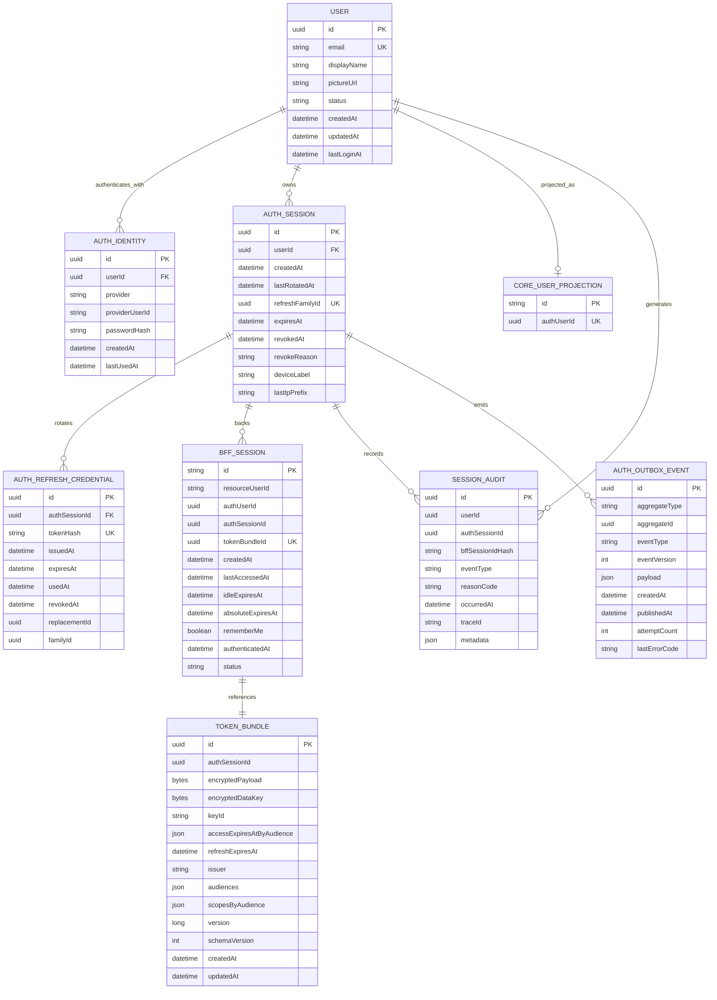
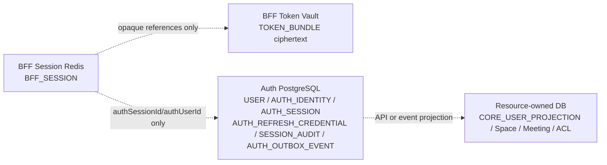

# ERD: BFF Auth and Gradual MSA

이 ERD는 저장소 소유권을 포함한 목표 논리 모델이다. T030에서 AuthSession별 refresh family, revoke outbox와 audience별 Token Bundle을 확정했다.

## Physical Ownership

- 점선은 물리 foreign key나 cross-database join이 아니다.
- BFF는 Auth DB를 직접 읽지 않고 내부 API를 사용한다.
- Resource Service는 Auth DB나 Redis를 직접 읽지 않는다.
- `USER`와 `CORE_USER_PROJECTION` 관계는 UUID 값의 논리 projection이며 물리 cross-DB FK가 아니다. Core의 기존 문자열 PK/FK는 유지한다.
- BFF_SESSION은 Browser/Core에 노출하는 `resourceUserId`와 내부 JWT/Auth index용 `authUserId`를 분리한다. 두 값은 `resourceUserId = "user-" + authUserId` 불변식을 가진다.
- 현재 Core Prototype ERD의 `AUTH_SESSION.refreshTokenHash`는 legacy schema이며 이 목표 ERD로 점진 대체한다.
- T031 물리 table은 각각 `auth_users`, `auth_identities`, `auth_sessions`, `auth_refresh_credentials`, `session_audits`, `auth_outbox_events`다. Auth runtime role은 업무 table의 `SELECT/INSERT/UPDATE`, 감사 table의 `SELECT/INSERT`만 수행하고 `DELETE`, schema/Flyway history를 소유하지 않는다.
