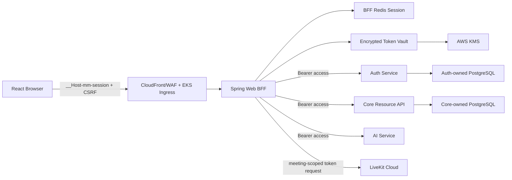

# Implementation Plan: BFF Auth and Gradual MSA

## Current State

- T020 이전 Frontend React/Vite는 `AuthSession`의 access/refresh token pair를 `sessionStorage`에 저장하고 `Authorization: Bearer`를 직접 구성했다.
- T020 이전 앱 시작은 저장 객체 존재만 확인하며 access 만료 계산, refresh 1회 재시도, logout API 연결이 없었다.
- Spring Backend `/api/v1/auth/*`는 자체/Google 로그인, access/refresh 발급, refresh rotation, logout과 `/me`를 제공한다.
- Backend는 access JWT를 직접 HMAC 검증하고 refresh hash/revoke를 PostgreSQL `auth_sessions`에 저장한다.
- Backend가 Auth와 Space/Meeting/AI proxy를 한 프로세스에서 제공하며 FastAPI AI 서버는 이미 별도 프로세스다.
- T010에서 별도 Spring Boot Web BFF, Spring Session Redis, health/probe, 로컬 Redis Compose와 독립 Docker/CI build 기반을 추가했다.
- T011에서 Spring Security, CSRF token endpoint, 운영/로컬 session cookie profile, session fixation 방지와 승인된 세션 수명 설정을 추가했다.
- T012에서 AES-256-GCM envelope encryption, AWS KMS/local key adapter와 Redis ciphertext store를 추가했다.
- T013에서 현재 Backend의 signup/login/google 고정 경로 compatibility client, BFF session 생성과 bootstrap, Remember me별 Redis TTL/persistent cookie 및 absolute expiry 차단을 추가했다.
- T014에서 access 만료 30초 전 선제 refresh, Redis 소유권 lock 기반 single-flight, downstream `401` 후 원 요청 최대 1회 재시도와 최종 실패 cleanup을 추가했다.
- T015에서 현재 Backend의 실제 `/api/v1/*` method/path만 허용하는 proxy, Core/AI/LiveKit별 JDK HTTP timeout, queue 없는 bulkhead와 연속 실패 circuit breaker를 추가했다. 업무 proxy는 T014 Token Manager를 통과한다.
- T016에서 CSRF가 적용된 현재 세션 logout과 실제 Redis·현재 Backend 프로세스 compatibility E2E를 추가했다. Browser 응답/Redis/로그 token scan, 강제 선제 refresh, logout 후 이전 cookie 재사용 차단과 멱등성을 CI에서 검증한다.
- T020에서 Frontend의 token 저장·Bearer 구성을 제거하고 `/api/v1/auth/session` bootstrap, same-origin cookie와 공통 CSRF 요청 준비를 적용했다. Vite는 `/api`를 BFF로만 proxy하며 Playwright는 Backend+BFF+Redis+Frontend 전체 경계를 실행한다.
- T021에서 현재 세션 로그아웃 control과 `/api/v1/auth/logout` CSRF 호출을 연결했다. 성공 시 인증·사용자별 화면 상태를 초기화하고 랜딩으로 이동하며, 네트워크 실패 시 서버 세션을 추측해 지우지 않고 로그인 상태와 재시도 오류를 유지한다.
- T022에서 업무 API와 LiveKit/auth 요청이 사용하는 공통 BFF fetch가 `401 SESSION_INVALID` body만 전역 세션 만료로 발행하도록 연결했다. 만료 시 현재 same-origin 경로를 검증해 보존하고 랜딩 document를 새로 로드한 뒤 재로그인 안내를 표시하며, 성공 로그인 후 해당 경로로 복귀한다. `INVALID_CREDENTIALS` 등 다른 `401`은 로컬 요청 오류로만 처리한다.
- T023에서 Browser traffic 수용 여부를 readiness로 drain하는 rollout flag와 login/refresh/logout/session/proxy 저카디널리티 metric을 추가했다. 5%→25%→50%→100% 단계별 guardrail과 7일 rollback window를 runbook에 고정하고, 위반 시 같은 cookie/Redis/Token Vault 계약의 안정 BFF release로 traffic만 복원하도록 했다.
- T030에서 AuthSession별 1회용 refresh family, KMS RSA-2048 `RS256` audience별 10분 JWT/JWKS, durable `sid` revoke event와 mTLS SPIFFE workload identity를 확정했다. 모든 기기 로그아웃은 최근 10분 인증 또는 local/Google 재인증 뒤 수행한다.
- T031에서 독립 Auth Service/비루트 Docker image와 전용 PostgreSQL을 추가했다. Flyway V1 스키마와 기존 migration을 변경하지 않는 V2 최소 권한 축소, DB 포함 readiness/DB 제외 liveness를 실제 PostgreSQL·Compose·권한 negative test로 검증했다. 인증 endpoint runtime은 T032 전까지 노출하지 않는다.
- T032에서 Web BFF workload 전용 internal signup/login/Google/refresh/revoke/revoke-all, BCrypt/HMAC 저장 경계, 1회용 refresh lineage/reuse family 폐기, 감사와 transactional outbox producer를 구현했다. direct certificate SPIFFE SAN을 기본으로 검증하고 local/test header는 운영 profile에서 강제로 무시한다. KMS signer가 없는 runtime은 발급 transaction 전체를 rollback하며 T033 전까지 임시 JWT를 만들지 않는다.
- T033은 KMS key ID만 가진 rotation key ring, `RAW` RS256 KMS 서명, 내부 JWKS와 5분 ETag cache Resource validator를 구현한다. 정기 교체 설정은 5분 선게시와 1시간 이전 key overlap을 시작 시 강제하고 침해 대응만 명시적 emergency mode로 예외 처리한다. Core 요청 경로의 legacy/new dual validation 활성화는 T035까지 보류한다.
- T034는 Core 문자열 User PK/FK를 유지하면서 V13 `auth_user_id UUID` projection을 canonical ID에 backfill했다. runtime bootJar와 분리된 Auth migration source set이 별도 source/target 연결로 User/AuthIdentity만 dry-run/apply/verify하고 ownership 충돌·비정형 mapping·대사 불일치를 fail closed한다. legacy AuthSession은 이전하지 않으며 최종 delta 쓰기 drain과 재로그인/rollback은 runbook에 고정했다.
- T036은 CI에서 발견된 BFF/Auth의 수정 가능한 Jackson/Tomcat 취약점을 Backend의 검증된 안전 버전으로 정렬하고, 고정 테스트 키에 대한 Gitleaks 오탐을 커밋·파일·규칙·라인 fingerprint 단위로만 예외 처리한다.
- T024에서 전용 local/Google 재인증, Auth-first revoke-all, Auth UUID Spring Session index 정리와 모든 기기 로그아웃 UI를 연결했다. 현재 session은 다른 session/Token Bundle 정리 뒤 마지막에 폐기하며 legacy provider는 기능 사용 불가로 fail closed한다.
- LiveKit client/server token 연동은 있으나 목표 운영 provider는 LiveKit Cloud로 확정됐다.

## Target Architecture

- Frontend: token/storage/header 로직을 제거하고 session bootstrap, CSRF, logout과 최종 401 처리만 담당한다.
- Web BFF: 브라우저의 유일한 API origin이며 Spring Security/Session, Token Manager, downstream allowlist, 응답 조합과 장애 격리를 담당한다.
- Auth Service: User/AuthIdentity/AuthSession, 자격 검증, access/refresh 발급·회전·폐기와 JWKS를 소유한다.
- Core Resource API: Space/Meeting/권한/AI source 선필터를 유지하고 access JWT subject 이후 최신 RBAC/ACL을 자신의 DB에서 평가한다.
- AI: 기존 FastAPI를 독립 EKS workload로 배포하며 public 브라우저 호출을 허용하지 않는다.
- LiveKit: LiveKit Cloud를 사용하며 참가자 token은 Core 권한 검증 뒤 제한적으로 발급한다.
- Data: BFF session Redis, Auth DB, Core DB를 논리적으로 분리하고 신규 서비스는 다른 서비스 DB를 직접 조회하지 않는다.
- Platform: AWS EKS 단일 리전 Multi-AZ, 복수 Pod, HPA/PDB/probe/NetworkPolicy와 관리형 ElastiCache/RDS/KMS를 목표로 한다.

## Technical Decisions

| Decision | Choice | Reason | Alternatives |
| --- | --- | --- | --- |
| Migration | Strangler 방식 | 기존 기능을 유지하며 BFF, Auth, 도메인을 순차 분리하고 rollback window를 둔다. | Big-bang MSA |
| Web entry | 별도 Spring Boot Web BFF | Spring Security/Session 재사용과 Java 운영 스택 일관성을 유지한다. | 기존 Backend 통합, Node BFF |
| Browser auth | Opaque server session cookie + CSRF | token을 브라우저에서 제거하고 logout/refresh 책임을 BFF로 통합한다. | Web Storage, refresh cookie only |
| Session lifetime | 기본 60분 idle/12시간 absolute, Remember me 7일 sliding/14일 absolute | 일반 업무 세션과 명시적 장기 로그인의 보안·UX를 분리하고 절대 상한을 유지한다. | 모든 세션 60분 idle, Remember me 14일 단일 TTL |
| Session store | BFF 전용 Redis | EKS 복수 Pod에서 sticky session 없이 세션을 공유한다. | Spring Session JDBC |
| Token storage | AES-256-GCM envelope encryption + AWS KMS data key | BFF는 refresh를 재사용할 수 있어야 하지만 저장소에는 ciphertext/encrypted data key만 남기고 bundle/session/version 바인딩 위변조를 거부한다. | 평문 Redis, hash-only BFF, token 직접 KMS Encrypt |
| Phase 1 auth integration | 현재 Backend 전용 allowlist compatibility client | Browser 계약을 tokenless session으로 먼저 전환하고 기존 인증/rollback 경로를 보존한다. | Backend token 응답 Browser 전달, Auth Service 즉시 추출 |
| Service access | KMS RSA-2048 `RS256`, 단일 audience별 10분 JWT + JWKS | Resource Service가 Auth Service에 매 요청 의존하지 않고 로컬 검증하며 다른 서비스 token 재사용을 막는다. | ES256, shared HMAC, opaque introspection |
| Refresh reuse | AuthSession별 1회용 family, grace 없음 | BFF single-flight로 정상 동시성을 처리하고 재사용이 감지된 의심 기기만 전체 폐기한다. | 이전 token만 거부, 사용자 전체 폐기, grace window |
| Access revoke | Auth transactional outbox + `sid` event + Resource local denylist | 중앙 조회 장애 전파 없이 로그아웃 access를 빠르게 차단하고 최악의 잔여 위험을 10분 TTL+60초 skew로 제한한다. | 매 요청 중앙 denylist/introspection, short JWT only |
| Workload auth | mTLS SPIFFE identity + NetworkPolicy/allowlist | shared secret 없이 workload를 상호 인증하고 principal 단위 최소 권한을 적용한다. | OAuth client credentials, 자체 요청 서명 |
| Google auth | 기존 ID credential 검증 유지 | 현재 요구는 Google API 권한이 아닌 로그인이다. | 즉시 Authorization Code/OIDC |
| Deployment | AWS EKS, single-region Multi-AZ | 장기 확장성과 서비스별 독립 배포를 선택했다. | ECS Fargate, multi-region |
| Media | LiveKit Cloud | UDP/TURN/media node 운영을 애플리케이션 장애 경계에서 분리한다. | Self-host LiveKit |
| Data ownership | Database per service target | 공유 DB 변경과 장애 전파를 줄인다. | Shared schema |
| User ID bridge | Core 문자열 PK 유지 + `auth_user_id UUID` projection | 업무 FK 재작성 없이 Auth/JWT UUID subject와 Core 사용자를 결정적으로 연결한다. | legacy subject 유지, Core PK/FK 일괄 UUID 전환 |
| Auth data migration | 반복 가능한 offline snapshot/delta + 짧은 auth write freeze | dual-write/CDC 없이 dry-run/apply/verify와 exact reconciliation으로 현재 전환 규모를 안전하게 검증한다. | application dual-write, CDC, lazy migration |

## Component Responsibilities

### Browser

- `__Host-mm-session` HttpOnly cookie는 브라우저가 자동 전송하고 JavaScript는 읽지 않는다.
- CSRF token만 읽어 상태 변경 요청 header에 넣는다.
- access/refresh, token 만료, refresh retry를 알지 않는다.
- 인증 상태는 `loading/authenticated/unauthenticated`와 사용자 표시 데이터로만 관리한다.

### Web BFF

- 로그인 성공 시 session fixation을 방지하기 위해 session ID를 교체한다.
- Spring Session에는 `userId`, `authSessionId`, `tokenBundleId`, `createdAt`, `absoluteExpiresAt`, `rememberMe`와 최소 표시 정보만 둔다.
- Token Manager는 access 만료 임박 또는 downstream `401`에서 refresh하며 한 세션의 refresh를 single-flight 처리한다.
- Token Vault는 Redis의 별도 namespace에 암호문만 저장한다. 신규 payload 암호화가 성공한 뒤 expected version 비교로 원자 교체하며 KMS/복호화/CAS 실패 시 기존 bundle을 유지하고 fail closed한다.
- 동적 proxy URL을 허용하지 않고 route별 목적 서비스, path, method를 allowlist로 매핑한다.
- downstream 오류를 common error shape로 정규화하고 AI/LiveKit 실패가 Core 성공으로 위장되지 않게 한다.

### Auth Service

- local password와 Google credential을 검증한다.
- audience별 access JWT 집합과 refresh를 mTLS 인증된 BFF internal API에만 반환한다.
- AuthSession별 refresh family hash/lineage/revoke와 transactional outbox를 저장한다.
- KMS `RS256` signing과 Resource Service가 5분 cache할 수 있는 JWKS를 제공한다.
- SpaceRole/MeetingRole 또는 AI source 권한을 token에 장기 내장하지 않는다.

#### T031 Foundation Boundary

- `auth`는 Java 21/Spring Boot 3.5.14의 독립 Gradle project와 non-root Docker image로 배포한다. 기본 내부 포트는 `8082`다.
- Auth PostgreSQL은 Core DB와 다른 database/volume을 사용한다. 로컬 Compose도 별도 PostgreSQL service로 장애·수명 경계를 분리한다.
- Flyway migrator와 runtime login role을 분리한다. migrator만 schema/DDL과 Flyway history를 소유한다. runtime은 업무 table의 `SELECT/INSERT/UPDATE`, 감사 table의 `SELECT/INSERT`만 가지며 `DELETE`와 future table default privilege는 후속 보존 기능에서 별도 승인한다.
- V1 forward-only migration은 `auth_users`, `auth_identities`, `auth_sessions`, `auth_refresh_credentials`, `session_audits`, `auth_outbox_events`와 T030 lineage/outbox 제약을 생성하고 V2는 이미 적용된 V1을 수정하지 않은 채 runtime 권한을 table별 최소 범위로 축소한다.
- readiness는 DB health를 포함해 신규 traffic을 차단하고 liveness는 process 상태만 포함해 DB 장애로 Pod 재시작이 반복되지 않게 한다.
- T031은 health/probe와 schema foundation만 제공한다. login/refresh/revoke와 transactional outbox producer는 T032, KMS signing/JWKS는 T033에서 구현하며 transport publisher는 T045 출시 gate로 둔다.

#### T032 Runtime Boundary

- internal auth endpoint는 direct client certificate의 SPIFFE URI SAN을 기본으로 검증하고 Web BFF principal만 허용한다. 인증서 제품이 미정인 동안 local/test profile에서만 명시적으로 켜는 test principal header를 허용하며 운영 기본값은 false다.
- local 비밀번호는 정책 검증 뒤 BCrypt 단방향 hash로만 저장한다. Google ID credential은 RS256 signature, issuer, audience, expiry, verified email을 검증하고 원문을 저장하지 않으며 동일한 verified email의 User에 Google AuthIdentity를 연결한다.
- refresh는 32-byte random 원문과 환경별 최소 32자 secret의 HMAC-SHA-256 lookup hash를 사용한다. 성공 rotation은 이전 credential 사용 처리, 다음 leaf와 lineage, AuthSession 회전 시각, 감사 기록을 한 transaction으로 커밋한다.
- 사용된 refresh가 다시 제시되면 예외를 던지기 전에 해당 AuthSession family, revoke outbox와 감사 기록을 같은 transaction으로 commit하고 다른 AuthSession은 유지한다.
- revoke/revoke-all은 AuthSession revoke, family credential revoke, session별 outbox와 감사를 원자 처리한다. revoke-all은 `currentAuthSessionId`/`userId` 결합과 최근 10분 `authenticatedAt`을 Auth Service가 다시 검증한다.
- T024 step-up 재인증은 현재 AuthSession/User 결합을 확인한 뒤 local 비밀번호 또는 이미 연결된 Google identity를 검증하고 Auth 서버 시각만 반환한다. login endpoint를 재사용해 새 AuthSession/token을 만들거나 Google identity를 새로 연결하지 않는다.
- audience access 발급은 T033 `AccessTokenIssuer` port로 분리한다. signer가 없으면 계정/identity/session/refresh 변경을 모두 rollback하며 runtime image에 test signer나 임시 algorithm을 포함하지 않는다.

### Resource Services

- access token의 `RS256`, `kid`, issuer, 자신의 단일 audience, `sub/sid/jti/iat/nbf/exp/ver`를 검증한다.
- Auth revoke event를 idempotent하게 소비해 `sid`를 최대 access 만료까지 로컬 denylist에 유지한다.
- `sub` 이후 자신의 최신 Space/Meeting RBAC/ACL을 조회한다.
- BFF가 전달한 사용자/권한 header를 서명 검증 없이 신뢰하지 않는다.
- 서비스 간 내부 호출은 mTLS SPIFFE principal과 endpoint allowlist를 함께 검증한다.

## API Contracts

- Browser-BFF: `contracts/browser-auth-api.md`
  - `GET /api/v1/auth/csrf`
  - `POST /api/v1/auth/signup`
  - `POST /api/v1/auth/login`
  - `POST /api/v1/auth/google`
  - `GET /api/v1/auth/session`
  - `POST /api/v1/auth/logout`
  - `POST /api/v1/auth/reauthenticate`
  - `POST /api/v1/auth/logout-all`
  - public `/auth/refresh`는 목표 계약에 없다.
- BFF-Auth: `contracts/auth-service-api.md`
  - `/internal/v1/auth/signup|login|google|refresh|revoke|reauthenticate|revoke-all`
  - `GET /.well-known/jwks.json`
- Auth revoke event: `contracts/auth-revocation-event.md`
  - Auth DB revoke와 outbox를 한 트랜잭션으로 커밋한다.
  - BFF/Resource Service가 at-least-once event를 `eventId` 기준으로 idempotent 처리한다.
- 점진 전환 중 Browser path는 유지하고 BFF compatibility client가 현재 Backend `/api/v1/auth/*` token 응답을 서버 측에서 소비한다.
- Phase 1 compatibility client는 고정 base URL과 `signup|login|google` 경로만 호출하고 임의 URL을 입력으로 받지 않는다. 현재 Backend가 AuthSession ID를 제공하지 않으므로 BFF 내부 호환 ID를 사용하며 Browser 응답에는 user/session view만 반환한다.
- Core/AI의 기존 public `/api/v1/*` shape는 BFF 외부 계약으로 유지하되 내부 서비스 주소를 브라우저에 노출하지 않는다.

## Data Model

- 전체 관계와 보존 규칙은 `data-model.md`, `erd.md`를 기준으로 한다.
- BffSession: Redis의 브라우저 세션, 사용자/Token Bundle 참조와 idle/absolute expiry.
- TokenBundle: 암호화된 audience별 access JWT 집합/refresh와 audience별 expiry/authSessionId/schema version.
- AuthSession: Auth Service의 논리 로그인 세션, 단일 refresh family와 revoke 상태.
- AuthRefreshCredential: 1회용 rotation hash, `familyId`와 `replacementId` lineage.
- AuthOutboxEvent: session revoke를 durable하게 발행하기 위한 transactional outbox.
- User/AuthIdentity: Auth Service 소유로 이동한다.
- SessionAudit: login/logout/revoke/reuse/security event만 영속 감사하고 token 원문은 저장하지 않는다.
- Core User projection: Resource DB의 기존 `users.id`/업무 FK는 유지하고 `users.auth_user_id UUID`를 Auth subject 연결용 unique projection으로 둔다. Auth DB를 join하지 않는다.

## Security and Permissions

- Cookie: 운영 `Secure`, `HttpOnly`, `SameSite=Strict`, `Path=/`, `Domain` 없음, `__Host-` prefix.
- CSRF: login/logout 포함 모든 state-changing Browser-BFF 요청에 Spring Security CSRF를 적용한다.
- CORS: Browser-BFF same-origin이 기본이며 내부 서비스는 브라우저 CORS를 허용하지 않는다.
- Token: 브라우저·URL·로그에 노출하지 않고 BFF 암호문/Auth hash 역할을 분리한다.
- Key: AWS KMS RSA-2048 `RS256`, 90일 rotation, 1시간 overlap과 5분 JWKS cache를 적용하고 private key를 반출하지 않는다.
- Key ring: `kid`와 KMS key ID, 공개 기간만 환경 설정으로 주입한다. 정기 rotation은 새 공개키 5분 선게시 후 active 전환, 이전 공개키 1시간 overlap 순서를 시작 시 검증하며 emergency mode만 침해 key 즉시 제거를 허용한다.
- Workload: 내부 호출은 mTLS SPIFFE identity, NetworkPolicy와 principal/endpoint allowlist를 모두 통과해야 한다.
- Secrets: EKS workload는 정적 AWS key 대신 workload IAM을 사용하고 secret/KMS 권한을 최소화한다.
- Authorization: BFF 인증과 Resource Service RBAC/ACL을 분리하고 MeetingMind 헌법의 AI 권한 선필터를 유지한다.
- Logout: revoke가 실패해도 BFF 로컬 세션/쿠키는 삭제하되 실패를 감사·재처리 대상으로 남긴다.

## Resilience and Failure Behavior

| Failure | Expected Behavior | Isolation Mechanism |
| --- | --- | --- |
| BFF Pod 1개 종료 | 다른 Pod가 Redis 세션으로 요청 처리 | replica, readiness, PDB, no sticky session |
| Redis unavailable | 인증 요청 fail closed, cookie 자체 신뢰 금지 | timeout, HA Redis, alert |
| Auth Service unavailable | 유효 access는 만료 전까지 Core가 로컬 검증, login/refresh는 실패 | local JWT validation, circuit breaker |
| Core unavailable | 해당 Core API만 고정 503, AI/LiveKit 성공으로 위장 금지 | service circuit/bulkhead |
| AI unavailable | AI 기능만 `AI_PROVIDER_UNAVAILABLE`, CRUD 유지 | existing AI error contract, bulkhead |
| LiveKit Cloud unavailable | 회의 입장 unavailable, 회의 metadata/report는 유지 | provider timeout/circuit breaker |
| KMS unavailable | 신규 token encrypt/decrypt/refresh fail closed, 평문 fallback 금지 | timeout, alert, bounded in-process access lifetime |
| AZ 장애 | 다른 AZ Pod/managed data replica로 복구 | Multi-AZ placement, PDB, managed failover |

## Parallel Work Plan

- Team Members: 초기 integration owner 1명, 영역별 owner는 구현 시작 전 확정
- Agents: 한 시점에 shared contract owner 1개 agent, 파일 경계가 분리된 뒤에만 병렬화

| Workstream | Owner | Agent | Scope | Expected Files | Dependencies |
| --- | --- | --- | --- | --- | --- |
| Docs/Contracts | 사용자 | Codex | 요구사항, 계약, 데이터 모델, ADR 결정 | `requirements/*`, `specs/002-bff-auth-msa/**` | - |
| Web BFF | 사용자 | Codex | Spring BFF, Session, CSRF, Token Manager, proxy allowlist | `bff/**` | contracts/data model |
| Frontend | 사용자 | Codex | token 저장 제거, session bootstrap, logout | `frontend/src/auth/**`, API clients, `App.tsx` | Browser-BFF contract, BFF endpoints |
| Backend compatibility | 사용자 | Codex | 현재 Backend token/API를 BFF internal client로 안전하게 수용 | `backend/**`, `bff/**` | BFF foundation |
| Auth Service | 사용자 | Codex | User/AuthIdentity/AuthSession 추출, JWT/JWKS/refresh/revoke outbox | future `auth/**` | T030, BFF compatibility |
| Platform | 사용자 | Codex | EKS, Redis, RDS, KMS, ingress, observability | future `infra/**`, Dockerfiles | Q-011~Q-013, service images |

## Conflict Boundaries

- Single-owner files:
  - `requirements/functional-requirements*.md`, `requirements/non-functional-requirements*.md`, `requirements/policies.md`: Docs/Contracts owner.
  - `specs/002-bff-auth-msa/contracts/*`, `data-model.md`, `erd.md`: shared contract owner.
  - `frontend/src/auth/**`, `frontend/src/App.tsx`: Frontend auth owner.
  - `backend/src/main/java/com/meetingmind/demo/auth/**`: Backend compatibility/Auth extraction owner.
  - migration 파일: 해당 서비스 Data owner가 forward-only로 생성한다.
- Shared contracts:
  - Browser session/cookie/CSRF와 error shape.
  - BFF-Auth token response, JWT/JWKS와 refresh/revoke.
  - User/AuthSession 데이터 이전과 service ownership.
- Do Not Edit Concurrently:
  - Browser auth contract 확정 전 Frontend/BFF login response를 각각 변경하지 않는다.
  - T030 계약과 다른 Auth token schema/JWT validator를 구현하지 않는다. 계약 변경 시 shared contract owner가 먼저 문서를 갱신한다.
  - 기존 공유 Flyway migration을 수정하지 않고 새 service migration으로 forward-only 이전한다.

## Integration Order

1. 요구사항·정책·용어의 BFF/Auth 역할을 확정한다.
2. Browser-BFF와 BFF-Auth 계약, 데이터 모델과 rollback 조건을 확정한다.
3. 별도 BFF skeleton과 로컬 Redis를 추가한다.
4. BFF가 현재 Backend auth/token API를 서버 측으로 감싸고 cookie session을 발급한다.
5. Frontend를 BFF session으로 전환하고 token 저장/header/public refresh 경로를 제거한다.
6. current/all-device logout과 expiry/refresh 회귀를 검증한다.
7. T030 refresh/JWT/revoke/workload 계약에 따라 Auth Service를 추출한다.
8. Core가 Auth JWKS로 access를 로컬 검증하고 기존 Auth package 호환 경로를 종료한다.
9. EKS에 BFF/Auth/Core/AI를 독립 배포하고 Redis/RDS/KMS/ingress를 연결한다.
10. 장애·부하 관측 결과를 기준으로 Realtime/Meeting/Workspace를 순차 추출한다.

## Test Plan

- Contract: Browser 응답/저장소에 token 문자열이 없고 cookie/CSRF/error shape가 일치한다.
- BFF unit: session creation/fixation, absolute expiry, single-flight refresh, 1회 retry, invalid refresh cleanup, route allowlist.
- Backend/Auth unit: password/Google 검증, hash/revoke, session-user binding, logout idempotency.
- Frontend unit: bootstrap loading, authenticated/unauthenticated, final 401, logout UI, token storage 미사용.
- Integration: Browser→BFF→현재 Backend, 이후 Browser→BFF→Auth/Core 두 경로를 같은 외부 계약으로 검증한다.
- Security: CSRF, CORS, cookie flags, token log/response/storage scan, unknown route/method proxy 거부.
- Resilience: BFF Pod 교체, Redis/Auth/Core/AI/LiveKit/KMS timeout과 circuit open, 부분 기능 유지.
- EKS: readiness/liveness, rolling update, PDB, HPA, AZ placement, NetworkPolicy와 workload IAM.
- Regression: `cd frontend && npm run test && npm run build`, `cd backend && ./gradlew test`, `cd ai && python -m compileall app`와 기존 권한 negative case.

## Rollout Plan

### Phase 0 — Documentation and Baseline

- 본 스펙/계약/데이터 모델을 합의하고 현재 token flow를 legacy compatibility로 표시한다.
- 브라우저·Backend auth E2E를 고정해 이후 외부 동작 비교 기준을 만든다.

### Phase 1 — Web BFF Compatibility

- `web-bff`와 Redis를 추가하고 BFF가 현재 Backend token pair를 서버 측 Token Bundle로 소비한다.
- Browser 경로는 same-origin BFF로 고정하고 BFF가 현재 Backend compatibility endpoint를 서버 측에서만 사용한다.
- Backend DB와 token API는 삭제하지 않는다.

### Phase 2 — Browser Cutover

- Frontend token 저장과 Bearer header를 제거하고 same-origin BFF만 호출한다.
- 오류율, login 성공률, refresh 성공률, Redis session과 logout 결과를 관측한다.
- rollback은 신규 BFF Pod를 readiness에서 drain하고 같은 session/Vault 계약의 안정 BFF deployment로 ingress traffic weight를 복원한다. Frontend direct Backend와 Browser token 재노출은 rollback 수단으로 사용하지 않는다.

### Phase 3 — Auth Service Extraction

- Core `users.auth_user_id`는 canonical `user-{UUID}` suffix로 backfill하고 legacy User/AuthIdentity만 Auth 전용 DB로 forward-only 이전한다.
- T034 도구는 source/target 별도 연결, dry-run/apply/verify와 exact reconciliation을 제공한다. 최초 snapshot 뒤 최종 delta 동안 legacy login/signup/Google 인증 쓰기를 짧게 중단하며 application dual-write나 DB link는 사용하지 않는다.
- legacy refresh/AuthSession은 새 HMAC/lineage로 안전하게 복구할 수 없으므로 이전하지 않는다. BFF→Auth 전환 시 기존 BFF session을 만료시키고 재로그인으로 새 AuthSession을 만든다.
- 비정형 legacy ID, projection 불일치, email/provider 소유권 충돌 또는 대사 불일치는 전환을 중단한다. 기존 DB/issuer는 rollback window 동안 삭제하지 않는다.
- Auth가 비대칭 access/JWKS를 발급하고 Core가 dual validation window에서 신규/legacy token을 구분한다.
- refresh/login/logout을 Auth로 전환한 뒤 legacy issuer를 중지한다.

#### T035 Implemented Boundary

T034 완료 뒤 실제 코드를 대조한 결과 T035는 다음 순서로 한 경계씩 통합한다.

1. Q-020/Q-021 권장안에 따라 Browser/Core external user ID는 `user-{Auth UUID}`를 유지하고 BFF가 신규 Core projection을 동기 생성한다.
2. BFF Auth client를 `legacy`와 `auth-service` provider로 분리하되 Browser endpoint/cookie/CSRF shape는 유지한다. provider fallback은 요청 실패 시 자동 수행하지 않고 배포 설정으로만 선택한다.
3. Token Bundle은 legacy 단일 access인 schema v1과 target audience별 access map인 schema v2를 명시적으로 구분한다. target route는 `CORE/AI/LIVEKIT`별 정확한 audience token만 선택하며 다른 audience나 legacy token을 복제하지 않는다.
4. BFF target 로그인은 Auth Service가 발급한 실제 `authSessionId`와 Auth User UUID를 session에 저장한다. Spring Session Redis의 principal/user index를 활성화해 T024가 사용자 전체 BffSession을 조회할 수 있게 한다.
5. Core는 JWT header profile로 legacy HS256과 target `RS256/at+jwt/kid`를 먼저 분류하고 선택된 validator 하나만 실행한다. target 검증 실패를 legacy validator로 재시도하지 않아 downgrade를 막는다.
6. target JWT `sub` UUID는 Core `users.auth_user_id`로 resource User를 찾고 기존 문자열 업무 FK를 사용한다. BFF는 target 인증 성공 뒤 Core target access+workload identity로 멱등 projection을 만들고 성공 후에만 Browser session을 만든다.
7. local/CI는 test source signer와 test workload principal만 사용하고 runtime image에는 signer/private key를 넣지 않는다. 운영 mTLS 제품과 KMS/EKS 연결은 Q-012/T040 이후 출시 gate다.
8. 기존 직렬화 session/Token Bundle은 추측 변환하지 않고 강제 재로그인한다. 새 schema v1/v2는 같은 release에서 legacy/target provider rollback을 지원하되 provider 실패를 자동 fallback하지 않는다.
9. 통합 검증은 Auth actual session/refresh/revoke, BFF audience selection·single-flight, 실제 Redis Auth UUID index, Core dual/target-only validation과 실제 PostgreSQL projection, Browser token 무노출과 명시적 legacy rollback을 포함한다.

#### T024 Implementation Boundary

1. 최근 인증이 지난 `logout-all`은 credential을 같은 요청 body에 섞지 않고 `403 REAUTHENTICATION_REQUIRED`로 step-up을 요구한다.
2. Browser `reauthenticate`는 method별 credential만 받고 BFF가 현재 server session의 Auth UUID/AuthSession ID를 결합한다. Auth가 반환한 서버 시각만 BFF `authenticatedAt`을 갱신한다.
3. Auth 재인증은 기존 local/Google verifier를 재사용하되 계정 생성, identity 연결, login timestamp 갱신, AuthSession/token 발급을 하지 않는다.
4. `logout-all`은 Auth DB 전체 revoke/outbox commit을 먼저 완료하고, BFF가 Auth UUID principal index로 다른 session을 먼저 삭제한 뒤 현재 session/cookie를 마지막에 무효화한다.
5. Token Bundle 삭제 실패는 암호문 TTL 정리를 보존하되 BffSession을 활성 상태로 남기는 근거가 되지 않는다. BffSession index 정리가 완료되지 않으면 `204`를 반환하지 않는다.
6. legacy provider에서는 Auth 전체 revoke가 불가능하므로 local-only 성공을 만들지 않고 기능 사용 불가로 fail closed한다.
7. 실제 PostgreSQL에서 재인증 결합/무세션 생성/전체 revoke를, 실제 Redis에서 두 BffSession/Token Bundle 삭제와 다른 cookie의 다음 요청 차단을 검증한다.

### Phase 4 — AWS EKS Production Baseline

- single-region Multi-AZ EKS, managed Redis/RDS/KMS, ingress/CloudFront/WAF와 observability를 구성한다.
- 최소 2 replica, probe, PDB, HPA와 failure drill을 통과한 서비스만 운영 전환한다.

### Phase 5 — Domain Extraction

- 기존 Core를 즉시 모두 쪼개지 않고 장애·부하·변경 경계가 확인된 Realtime/STT, Meeting, Workspace 순서 후보로 추출한다.
- 각 추출은 service-owned DB, API/event contract, 독립 rollback과 SLO를 가져야 한다.

## Phase Gates and Rollback

| Phase | Entry Gate | Exit Gate | Rollback Boundary |
| --- | --- | --- | --- |
| 1 BFF compatibility | M001 문서 합의, 현재 auth E2E 고정 | token 무노출/CSRF/refresh/logout 통합 테스트 | 안정 BFF release와 현재 Backend compatibility API/DB 보존 |
| 2 Browser cutover | BFF 호환 E2E와 관측 지표 준비 | login/refresh/logout 오류율과 session 복원 기준 충족 | 신규 BFF readiness drain, 안정 BFF traffic 100% 복원, Redis/Vault 데이터 보존 |
| 3 Auth extraction | T030 계약 완료, Auth DB migration 검증 | refresh reuse/revoke event/mTLS, dual validation/reconciliation/JWKS rotation 통과 | 신규 issuer 발급 중지, legacy issuer/DB 읽기 보존 |
| 4 EKS baseline | Q-011~Q-013 결정, IaC review | AZ/Pod/data/provider failure drill과 SLO 통과 | 이전 deployment/traffic weight 복원, 데이터 파괴 금지 |
| 5 Domain extraction | 관측 근거와 별도 feature spec | API/event reconciliation와 독립 SLO 통과 | strangler route를 Core로 복원, forward-only 데이터 보존 |
